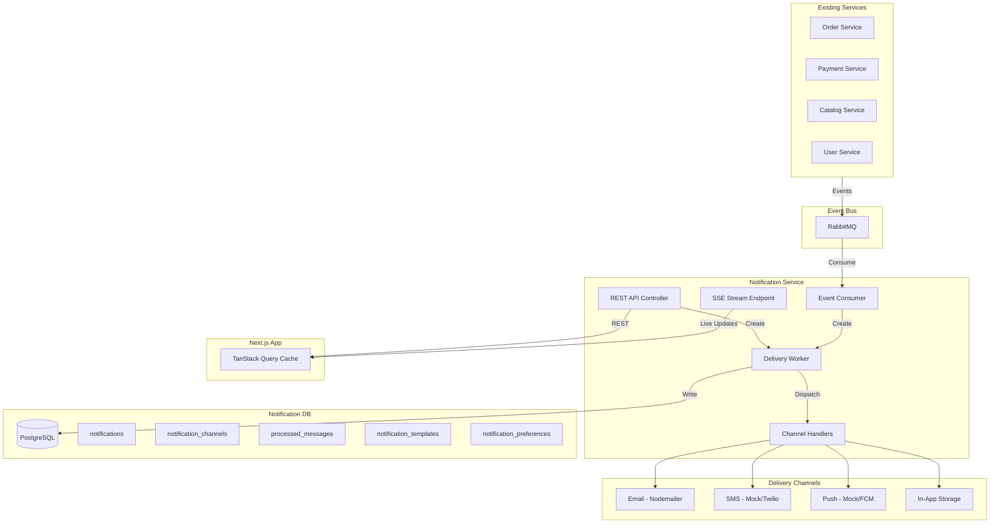
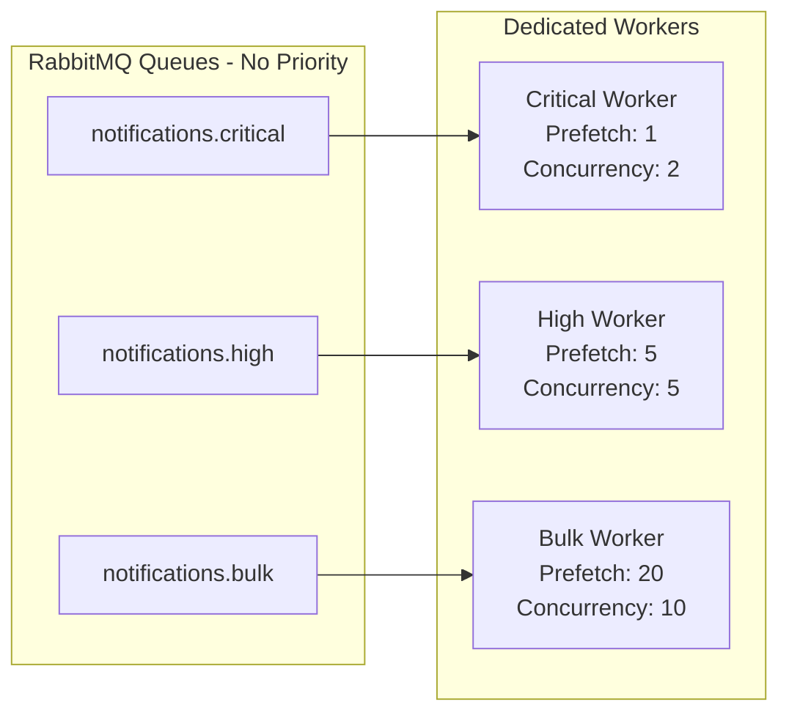
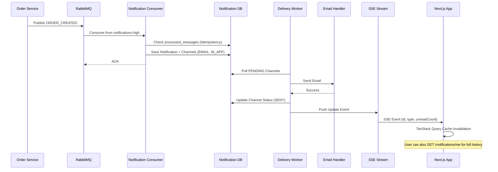
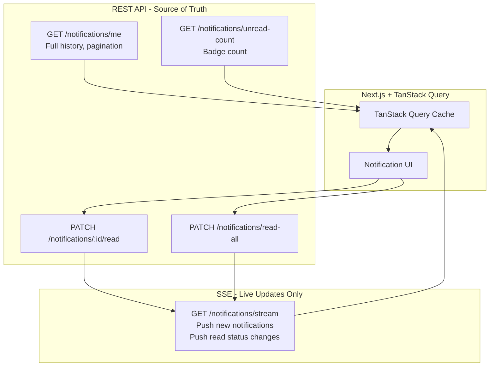

# 📬 Notification Service - Architecture & Implementation Plan

## 🎯 Overview
A priority-based notification service that ensures critical messages (order confirmations, payment failures, stock alerts) are delivered before low-priority ones (marketing emails, newsletters). Built following Modular Mart's architectural patterns: **Database-per-Service**, **Event-Driven Choreography**, **Microservice Chassis**, and **At-Least-Once Processing** with idempotency guarantees.

---

## 🏗 Architecture Design

### High-Level Architecture


### Priority Queue Strategy


---

## 📊 Data Model (5 Tables)

### 1. **notifications** (Core Entity)
```sql
CREATE TABLE notifications (
  id UUID PRIMARY KEY DEFAULT gen_random_uuid(),
  user_id VARCHAR(255) NOT NULL,
  type VARCHAR(100) NOT NULL, -- ORDER_CONFIRMED, PAYMENT_FAILED, etc.
  priority VARCHAR(20) NOT NULL, -- CRITICAL, HIGH, BULK
  subject VARCHAR(500),
  content TEXT, -- JSON or plain text
  metadata JSONB, -- {orderId, paymentId, etc.}
  scheduled_at TIMESTAMP,
  is_read BOOLEAN DEFAULT FALSE,
  read_at TIMESTAMP,
  created_at TIMESTAMP DEFAULT NOW(),
  updated_at TIMESTAMP DEFAULT NOW()
);

CREATE INDEX idx_notifications_user_id ON notifications(user_id);
CREATE INDEX idx_notifications_created_at ON notifications(created_at DESC);
CREATE INDEX idx_notifications_is_read ON notifications(is_read) WHERE is_read = FALSE;
```

### 2. **notification_channels** (Per-Channel Delivery Tracking)
```sql
CREATE TABLE notification_channels (
  id UUID PRIMARY KEY DEFAULT gen_random_uuid(),
  notification_id UUID NOT NULL REFERENCES notifications(id) ON DELETE CASCADE,
  channel VARCHAR(20) NOT NULL, -- EMAIL, SMS, PUSH, IN_APP
  status VARCHAR(20) NOT NULL, -- PENDING, PROCESSING, SENT, FAILED, RETRYING
  sent_at TIMESTAMP,
  failure_reason TEXT,
  retry_count INT DEFAULT 0,
  max_retries INT DEFAULT 3,
  created_at TIMESTAMP DEFAULT NOW(),
  updated_at TIMESTAMP DEFAULT NOW()
);

CREATE INDEX idx_channels_notification_id ON notification_channels(notification_id);
CREATE INDEX idx_channels_status ON notification_channels(status) WHERE status IN ('PENDING', 'RETRYING');
```

### 3. **processed_messages** (Idempotency)
```sql
CREATE TABLE processed_messages (
  id UUID PRIMARY KEY DEFAULT gen_random_uuid(),
  message_id VARCHAR(255) UNIQUE NOT NULL,
  event_type VARCHAR(100) NOT NULL,
  processed_at TIMESTAMP DEFAULT NOW()
);

CREATE INDEX idx_processed_messages_message_id ON processed_messages(message_id);
```

### 4. **notification_templates** (Template Management)
```sql
CREATE TABLE notification_templates (
  id UUID PRIMARY KEY DEFAULT gen_random_uuid(),
  type VARCHAR(100) NOT NULL, -- ORDER_CONFIRMED, PAYMENT_FAILED
  channel VARCHAR(20) NOT NULL, -- EMAIL, SMS, PUSH, IN_APP
  subject VARCHAR(500), -- with placeholders: {{userName}}
  body TEXT NOT NULL, -- with placeholders
  is_active BOOLEAN DEFAULT TRUE,
  created_at TIMESTAMP DEFAULT NOW(),
  updated_at TIMESTAMP DEFAULT NOW(),
  UNIQUE(type, channel)
);
```

### 5. **notification_preferences** (User Opt-In/Out)
```sql
CREATE TABLE notification_preferences (
  id UUID PRIMARY KEY DEFAULT gen_random_uuid(),
  user_id VARCHAR(255) UNIQUE NOT NULL,
  email_enabled BOOLEAN DEFAULT TRUE,
  sms_enabled BOOLEAN DEFAULT FALSE,
  push_enabled BOOLEAN DEFAULT TRUE,
  marketing_enabled BOOLEAN DEFAULT FALSE, -- Opt-in for promotional
  created_at TIMESTAMP DEFAULT NOW(),
  updated_at TIMESTAMP DEFAULT NOW()
);

CREATE INDEX idx_preferences_user_id ON notification_preferences(user_id);
```

---

## 🔄 Event Flow & Delivery Strategy

### Example: Order Confirmation Flow


### SSE as Live Delivery Layer (Not Source of Truth)


**Key Principle:** REST endpoints are the source of truth. SSE only pushes incremental updates to keep the cache fresh without polling.

---

## 🎨 Folder Structure

```
apps/notification-service/
├── src/
│   ├── config/
│   │   ├── config.module.ts
│   │   └── env.schema.ts                    # Zod validation
│   │
│   ├── notifications/
│   │   ├── entities/
│   │   │   ├── notification.entity.ts
│   │   │   ├── notification-channel.entity.ts
│   │   │   ├── processed-message.entity.ts
│   │   │   ├── notification-template.entity.ts
│   │   │   └── notification-preference.entity.ts
│   │   │
│   │   ├── dto/
│   │   │   ├── create-notification.dto.ts
│   │   │   ├── notification-response.dto.ts
│   │   │   ├── update-preference.dto.ts
│   │   │   └── notification-list.dto.ts
│   │   │
│   │   ├── enums/
│   │   │   ├── notification-type.enum.ts
│   │   │   ├── notification-priority.enum.ts
│   │   │   ├── notification-channel.enum.ts
│   │   │   └── channel-status.enum.ts
│   │   │
│   │   ├── workers/
│   │   │   ├── delivery-worker.service.ts   # Polls DB & dispatches
│   │   │   └── retry-worker.service.ts      # Handles failed channels
│   │   │
│   │   ├── handlers/
│   │   │   ├── notification-handler.interface.ts
│   │   │   ├── email.handler.ts             # Nodemailer
│   │   │   ├── sms.handler.ts               # Mock/Twilio
│   │   │   ├── push.handler.ts              # Mock/FCM
│   │   │   └── in-app.handler.ts            # DB storage only
│   │   │
│   │   ├── consumers/
│   │   │   ├── order-events.consumer.ts     # ORDER_CREATED, ORDER_CANCELLED
│   │   │   ├── payment-events.consumer.ts   # PAYMENT_SUCCEEDED, PAYMENT_FAILED
│   │   │   ├── catalog-events.consumer.ts   # STOCK_LOW, PRICE_CHANGED
│   │   │   └── user-events.consumer.ts      # USER_REGISTERED
│   │   │
│   │   ├── notifications.controller.ts      # REST + SSE endpoints
│   │   ├── notifications.service.ts         # Core business logic
│   │   ├── template.service.ts              # Template rendering
│   │   ├── preference.service.ts            # User preferences
│   │   ├── sse.service.ts                   # SSE connection manager
│   │   └── notifications.module.ts
│   │
│   ├── migrations/
│   │   ├── 1779100000000-CreateNotificationTable.ts
│   │   ├── 1779100000001-CreateNotificationChannelTable.ts
│   │   ├── 1779100000002-CreateProcessedMessageTable.ts
│   │   ├── 1779100000003-CreateTemplateTable.ts
│   │   └── 1779100000004-CreatePreferenceTable.ts
│   │
│   ├── common/
│   │   └── rabbitmq-message-handler.decorator.ts
│   │
│   ├── app.module.ts
│   ├── main.ts
│   └── tracing.ts
│
├── test/
│   └── app.e2e-spec.ts
│
├── .env
├── .env.example
├── Dockerfile
├── package.json
├── tsconfig.json
├── tsconfig.build.json
├── nest-cli.json
├── typeorm.config.ts
└── README.md
```

---

## 📦 Shared Packages to Use

### From `packages/common`
- ✅ **Logger** (`@mart/common/logger`) - Structured Pino logging
- ✅ **Tracing** (`@mart/common/tracing`) - Correlation ID propagation
- ✅ **Metrics** (`@mart/common/metrics`) - Prometheus metrics
- ✅ **Messaging** (`@mart/common/messaging`) - RabbitMQ abstractions
- ✅ **Health** (`@mart/common/health`) - Health check endpoints
- ✅ **Filters** (`@mart/common/filters`) - Global exception filters
- ✅ **Middlewares** (`@mart/common/middlewares`) - Request logging

### From `packages/auth`
- ✅ **ClerkGuard** (`@mart/auth`) - Authentication for user endpoints
- ✅ **RolesGuard** (`@mart/auth`) - RBAC for admin endpoints
- ✅ **CurrentUser** (`@mart/auth`) - Extract userId from JWT

### From `packages/database`
- ✅ **DatabaseModule** (`@mart/database`) - TypeORM configuration
- ✅ **BaseEntity** (`@mart/database`) - Shared entity base class

### From `packages/contracts`
- ✅ **Event Schemas** (`@mart/contracts`) - Shared event DTOs
  - `OrderCreatedEvent`
  - `PaymentSucceededEvent`
  - `PaymentFailedEvent`
  - `StockLowEvent`
  - `UserRegisteredEvent`

---

## 🔧 Technical Implementation Details

### 1. Priority Mapping Strategy
```typescript
// Map event types to queue routing
const PRIORITY_MAP = {
  // CRITICAL - Immediate action required
  PAYMENT_FAILED: 'notifications.critical',
  ORDER_CANCELLED: 'notifications.critical',
  SECURITY_ALERT: 'notifications.critical',
  
  // HIGH - Important transactional
  ORDER_CREATED: 'notifications.high',
  PAYMENT_SUCCEEDED: 'notifications.high',
  STOCK_RESERVED: 'notifications.high',
  ORDER_SHIPPED: 'notifications.high',
  
  // BULK - Marketing/Promotional
  USER_REGISTERED: 'notifications.bulk',
  NEWSLETTER: 'notifications.bulk',
  PROMOTIONAL: 'notifications.bulk',
  STOCK_LOW: 'notifications.bulk',
  PRICE_CHANGED: 'notifications.bulk',
};
```

### 2. RabbitMQ Queue Configuration (No Priority, Just Routing)
```typescript
// Separate queues, dedicated workers
const QUEUE_CONFIG = {
  'notifications.critical': {
    durable: true,
    prefetch: 1,      // Process one at a time
    concurrency: 2,   // 2 workers
  },
  'notifications.high': {
    durable: true,
    prefetch: 5,
    concurrency: 5,
  },
  'notifications.bulk': {
    durable: true,
    prefetch: 20,
    concurrency: 10,
  },
};
```

### 3. Retry Strategy with Exponential Backoff
```typescript
const RETRY_CONFIG = {
  maxRetries: 3,
  delays: [30, 300, 1800], // 30s, 5min, 30min
  deadLetterQueue: 'notifications.dlq',
};

// Per-channel retry logic
async retryFailedChannel(channel: NotificationChannel) {
  if (channel.retryCount >= channel.maxRetries) {
    await this.moveToDeadLetterQueue(channel);
    return;
  }
  
  const delay = RETRY_CONFIG.delays[channel.retryCount];
  await this.scheduleRetry(channel, delay);
}
```

### 4. Channel Handler Factory Pattern
```typescript
interface INotificationHandler {
  send(notification: Notification, channel: NotificationChannel): Promise<void>;
  supports(channelType: ChannelType): boolean;
}

class NotificationHandlerFactory {
  constructor(
    private emailHandler: EmailHandler,
    private smsHandler: SmsHandler,
    private pushHandler: PushHandler,
    private inAppHandler: InAppHandler,
  ) {}

  getHandler(channelType: ChannelType): INotificationHandler {
    switch (channelType) {
      case ChannelType.EMAIL: return this.emailHandler;
      case ChannelType.SMS: return this.smsHandler;
      case ChannelType.PUSH: return this.pushHandler;
      case ChannelType.IN_APP: return this.inAppHandler;
    }
  }
}
```

### 5. SSE Connection Manager
```typescript
@Injectable()
export class SseService {
  private connections = new Map<string, Response>();

  addConnection(userId: string, res: Response) {
    this.connections.set(userId, res);
  }

  removeConnection(userId: string) {
    this.connections.delete(userId);
  }

  pushUpdate(userId: string, event: NotificationEvent) {
    const res = this.connections.get(userId);
    if (res) {
      res.write(`data: ${JSON.stringify(event)}\n\n`);
    }
  }

  // Broadcast to all connected users
  broadcast(event: NotificationEvent) {
    this.connections.forEach((res) => {
      res.write(`data: ${JSON.stringify(event)}\n\n`);
    });
  }
}
```

---

## 🎯 API Endpoints

### Authenticated User Endpoints
```
GET    /notifications/me                # Get user's notifications (paginated)
                                         # Query: ?page=1&limit=20&unreadOnly=false

GET    /notifications/unread-count      # Get unread count for badge
                                         # Response: { count: 5 }

GET    /notifications/stream            # SSE endpoint for real-time updates
                                         # Returns: text/event-stream

PATCH  /notifications/:id/read          # Mark single notification as read
                                         # Triggers SSE update

PATCH  /notifications/read-all          # Mark all as read
                                         # Triggers SSE update

GET    /notifications/preferences       # Get user preferences
PATCH  /notifications/preferences       # Update preferences (opt-in/out)
```

### Admin Endpoints (Protected with RolesGuard)
```
GET    /admin/notifications             # List all (paginated, filterable)
GET    /admin/notifications/stats       # Delivery stats, failure rates
POST   /admin/notifications/broadcast   # Broadcast to all users

POST   /admin/templates                 # Create template
GET    /admin/templates                 # List templates
PATCH  /admin/templates/:id             # Update template
DELETE /admin/templates/:id             # Soft delete template
```

### Internal Endpoints (Not exposed via API Gateway)
```
POST   /internal/notifications          # Create notification (service-to-service)
```

---

## 📋 Implementation Checklist

### Phase 1: Foundation Setup ✅
- [ ] Create `apps/notification-service` directory structure
- [ ] Setup `package.json` with dependencies:
  - [ ] `@nestjs/common`, `@nestjs/core`, `@nestjs/microservices`
  - [ ] `@nestjs/typeorm`, `typeorm`, `pg`
  - [ ] `amqplib`, `amqp-connection-manager`
  - [ ] `nodemailer`, `@types/nodemailer`
  - [ ] `handlebars` (template rendering)
  - [ ] `zod` (env validation)
- [ ] Configure TypeORM (`typeorm.config.ts`)
- [ ] Setup environment schema (`env.schema.ts`)
- [ ] Create `.env` and `.env.example`
- [ ] Add to `turbo.json` pipeline

### Phase 2: Database Layer ✅
- [ ] Create entity files (5 entities):
  - [ ] `notification.entity.ts`
  - [ ] `notification-channel.entity.ts`
  - [ ] `processed-message.entity.ts`
  - [ ] `notification-template.entity.ts`
  - [ ] `notification-preference.entity.ts`
- [ ] Create migration files (5 migrations)
- [ ] Create enums:
  - [ ] `notification-type.enum.ts`
  - [ ] `notification-priority.enum.ts`
  - [ ] `notification-channel.enum.ts`
  - [ ] `channel-status.enum.ts`
- [ ] Run migrations and verify schema

### Phase 3: Core Business Logic ✅
- [ ] Create DTOs:
  - [ ] `create-notification.dto.ts`
  - [ ] `notification-response.dto.ts`
  - [ ] `notification-list.dto.ts`
  - [ ] `update-preference.dto.ts`
- [ ] Implement `notifications.service.ts`:
  - [ ] `createNotification()` - Save notification + channels
  - [ ] `getUserNotifications()` - Query with pagination
  - [ ] `getUnreadCount()` - Count unread
  - [ ] `markAsRead()` - Update single notification
  - [ ] `markAllAsRead()` - Bulk update
- [ ] Implement `template.service.ts`:
  - [ ] `renderTemplate()` - Handlebars rendering
  - [ ] `getTemplateByType()` - Fetch from DB
- [ ] Implement `preference.service.ts`:
  - [ ] `getUserPreferences()` - Get or create default
  - [ ] `updatePreferences()` - Update opt-ins

### Phase 4: Channel Handlers ✅
- [ ] Create handler interface (`notification-handler.interface.ts`)
- [ ] Implement handlers:
  - [ ] `email.handler.ts` - Nodemailer integration
  - [ ] `sms.handler.ts` - Mock implementation (console.log)
  - [ ] `push.handler.ts` - Mock implementation (console.log)
  - [ ] `in-app.handler.ts` - No-op (already in DB)
- [ ] Create handler factory
- [ ] Add error handling and logging per handler

### Phase 5: Event Consumers ✅
- [ ] Setup RabbitMQ connection in `app.module.ts`
- [ ] Create 3 queues (critical, high, bulk)
- [ ] Implement consumers:
  - [ ] `order-events.consumer.ts` (ORDER_CREATED, ORDER_CANCELLED)
  - [ ] `payment-events.consumer.ts` (PAYMENT_SUCCEEDED, PAYMENT_FAILED)
  - [ ] `catalog-events.consumer.ts` (STOCK_LOW, PRICE_CHANGED)
  - [ ] `user-events.consumer.ts` (USER_REGISTERED)
- [ ] Add idempotency checks (processed_messages table)
- [ ] Route events to correct queue based on priority

### Phase 6: Delivery Workers ✅
- [ ] Implement `delivery-worker.service.ts`:
  - [ ] Poll notification_channels table (status = PENDING)
  - [ ] Dispatch to channel handlers
  - [ ] Update channel status (SENT/FAILED)
  - [ ] Trigger SSE updates on success
- [ ] Implement `retry-worker.service.ts`:
  - [ ] Query FAILED channels
  - [ ] Apply exponential backoff
  - [ ] Move to DLQ after max retries
- [ ] Add scheduled jobs (@nestjs/schedule)

### Phase 7: SSE Implementation ✅
- [ ] Implement `sse.service.ts`:
  - [ ] Connection manager (Map<userId, Response>)
  - [ ] `addConnection()`, `removeConnection()`
  - [ ] `pushUpdate()` - Send to specific user
  - [ ] Handle connection cleanup on disconnect
- [ ] Add SSE endpoint in controller:
  - [ ] `GET /notifications/stream`
  - [ ] Set headers (text/event-stream, no-cache)
  - [ ] Keep-alive heartbeat every 30s
- [ ] Integrate with delivery worker to push updates

### Phase 8: REST API ✅
- [ ] Implement `notifications.controller.ts`:
  - [ ] `GET /notifications/me` (with pagination)
  - [ ] `GET /notifications/unread-count`
  - [ ] `GET /notifications/stream` (SSE)
  - [ ] `PATCH /notifications/:id/read`
  - [ ] `PATCH /notifications/read-all`
  - [ ] `GET /notifications/preferences`
  - [ ] `PATCH /notifications/preferences`
- [ ] Add Clerk guards (@UseGuards(ClerkGuard))
- [ ] Extract userId from JWT (@CurrentUser())
- [ ] Add validation pipes
- [ ] Add admin endpoints with RolesGuard

### Phase 9: Observability ✅
- [ ] Integrate `@mart/common/logger`
- [ ] Add correlation ID tracing
- [ ] Add Prometheus metrics:
  - [ ] `notifications_created_total{priority, type}`
  - [ ] `notifications_sent_total{priority, channel}`
  - [ ] `notifications_failed_total{priority, channel, reason}`
  - [ ] `notification_delivery_duration_seconds{channel}`
  - [ ] `notification_channels_pending{priority}`
  - [ ] `sse_connections_active`
- [ ] Add health checks (`/health`)
- [ ] Add structured logging for all operations

### Phase 10: Testing & Deployment ✅
- [ ] Unit tests for services
- [ ] Integration tests for consumers
- [ ] E2E tests for API endpoints
- [ ] Test SSE connection handling
- [ ] Create `Dockerfile` (multi-stage)
- [ ] Add to `docker-compose.yml`
- [ ] Update API Gateway routes
- [ ] Seed notification templates
- [ ] Update root README.md

---

## 🔐 Environment Variables

```bash
# Database
DATABASE_HOST=localhost
DATABASE_PORT=5432
DATABASE_NAME=notification_db
DATABASE_USER=postgres
DATABASE_PASSWORD=postgres

# RabbitMQ
RABBITMQ_URL=amqp://localhost:5672
RABBITMQ_EXCHANGE=mart.events

# Email (Nodemailer)
SMTP_HOST=smtp.gmail.com
SMTP_PORT=587
SMTP_USER=noreply@modularmart.com
SMTP_PASSWORD=your_app_password
SMTP_FROM=Modular Mart <noreply@modularmart.com>

# SMS (Twilio - Optional, mocked by default)
TWILIO_ACCOUNT_SID=
TWILIO_AUTH_TOKEN=
TWILIO_PHONE_NUMBER=

# Push (FCM - Optional, mocked by default)
FCM_SERVER_KEY=

# Service
PORT=3005
NODE_ENV=development

# Observability
JAEGER_ENDPOINT=http://localhost:14268/api/traces
SENTRY_DSN=

# Clerk
CLERK_SECRET_KEY=sk_test_xxx
```

---

## 🚀 Key Features

### 1. **Priority-Based Processing**
- Critical notifications (payment failures) processed immediately with dedicated workers
- Bulk notifications (newsletters) processed with higher concurrency but lower urgency
- Separate queues prevent head-of-line blocking

### 2. **At-Least-Once Processing with Idempotency**
- Idempotent consumers prevent duplicate notifications
- Retry mechanism with exponential backoff
- Dead Letter Queue for manual intervention
- No guarantees of "zero message loss" - realistic expectations

### 3. **Multi-Channel Support with Per-Channel Tracking**
- Email (Nodemailer)
- SMS (Mocked, Twilio-ready)
- Push (Mocked, FCM-ready)
- In-App (Database storage)
- Each channel tracked independently in `notification_channels` table

### 4. **Real-Time Updates via SSE**
- SSE endpoint for live updates to Next.js app
- TanStack Query cache invalidation on new notifications
- REST API remains source of truth
- SSE only pushes incremental updates

### 5. **User Preferences**
- Opt-in/out per channel (email, SMS, push)
- Marketing preferences (promotional emails)
- Respects user choices before sending

### 6. **Template Management**
- Dynamic templates with Handlebars placeholders
- Per-channel customization
- Admin UI for template editing

### 7. **Observability**
- Distributed tracing across services
- Metrics for delivery rates, latency, failures
- Structured logging for debugging
- Active SSE connection monitoring

---

## 📈 Metrics to Track

```typescript
// Prometheus Metrics
- notifications_created_total{priority, type}
- notifications_sent_total{priority, channel}
- notifications_failed_total{priority, channel, reason}
- notification_delivery_duration_seconds{channel}
- notification_channels_pending{priority}
- notification_retry_count{priority, channel}
- channel_handler_errors_total{channel, error_type}
- sse_connections_active
- sse_events_pushed_total{event_type}
```

---

## 🎓 Learning Outcomes

By building this service, you'll learn:

1. ✅ **Priority Queue Management** - RabbitMQ queue routing strategies
2. ✅ **Idempotent Consumers** - At-least-once processing semantics
3. ✅ **Multi-Channel Notifications** - Handler factory pattern
4. ✅ **Per-Channel Tracking** - Independent delivery status per channel
5. ✅ **Retry Strategies** - Exponential backoff & DLQ
6. ✅ **Template Rendering** - Handlebars integration
7. ✅ **SSE (Server-Sent Events)** - Real-time updates to frontend
8. ✅ **TanStack Query Integration** - Cache invalidation patterns
9. ✅ **Event-Driven Architecture** - Choreographed sagas
10. ✅ **Microservice Patterns** - Database-per-service, chassis
11. ✅ **User Preferences** - Opt-in/out management
12. ✅ **Observability** - LGTM stack integration
13. ✅ **NestJS Advanced** - Hybrid microservices, decorators, scheduled jobs

---

## 🔗 Integration Points

### Events to Consume
```typescript
// From Order Service
- ORDER_CREATED → High priority (email + in-app)
- ORDER_CANCELLED → Critical priority (email + SMS)
- ORDER_SHIPPED → High priority (email + push)

// From Payment Service
- PAYMENT_SUCCEEDED → High priority (email + in-app)
- PAYMENT_FAILED → Critical priority (email + SMS)

// From Catalog Service
- STOCK_LOW → Bulk priority (admin notification)
- PRICE_CHANGED → Bulk priority (wishlist users)

// From User Service
- USER_REGISTERED → Bulk priority (welcome email)
```

### Events to Publish (Optional - Not in Initial Scope)
```typescript
// If needed for analytics/monitoring
- NOTIFICATION_SENT → Analytics service
- NOTIFICATION_FAILED → Monitoring service
```

---

## 🛡️ Error Handling Strategy

### 1. **Transient Errors** (Network, Rate Limits)
- Retry with exponential backoff (30s, 5min, 30min)
- Max 3 retries per channel
- Move to DLQ after exhaustion

### 2. **Permanent Errors** (Invalid Email, Template Missing)
- Mark channel as FAILED immediately
- Log error details with correlation ID
- Alert admin via monitoring

### 3. **Partial Failures** (Multi-Channel)
- Track per-channel status independently
- Retry only failed channels
- Report partial success (e.g., email sent, SMS failed)

### 4. **Idempotency Violations**
- Check `processed_messages` before processing
- Skip duplicate events silently
- Log duplicate attempts for monitoring

---

## 📝 Additional Notes

### Why Not Use a Third-Party Service (SendGrid, Twilio, etc.)?
- **Learning**: Building from scratch teaches core patterns
- **Control**: Full control over priority logic and retry strategies
- **Cost**: No per-message pricing for learning project
- **Privacy**: Sensitive data stays in-house

### Why 5 Tables Instead of 4?
- `notifications` - Core notification data
- `notification_channels` - Per-channel delivery tracking (critical for multi-channel)
- `processed_messages` - Idempotency
- `notification_templates` - Template management
- `notification_preferences` - User opt-in/out

### SSE vs WebSockets?
- **SSE**: Simpler, unidirectional (server → client), built-in reconnection
- **WebSockets**: Bidirectional, more complex, overkill for notifications
- **Choice**: SSE is perfect for pushing updates to TanStack Query cache

### Future Enhancements (Out of Scope)
- [ ] Scheduled notifications (cron-based)
- [ ] Notification batching (digest emails)
- [ ] A/B testing for templates
- [ ] Analytics dashboard
- [ ] Notification grouping (thread-like)
- [ ] Rich media support (images, videos)

---

## 🎯 Success Criteria

✅ Critical notifications delivered within 5 seconds  
✅ High-priority notifications delivered within 30 seconds  
✅ At-least-once processing with idempotency guarantees  
✅ No duplicate sends (processed_messages table)  
✅ Per-channel delivery tracking  
✅ User preferences respected (opt-in/out)  
✅ SSE updates pushed to Next.js app in real-time  
✅ REST API as source of truth for notification history  
✅ 95%+ delivery success rate (realistic, not "guaranteed")  
✅ Full observability (logs, metrics, traces)  
✅ Clean, maintainable code following NestJS best practices  

---

**Ready to implement?** Start with Phase 1 and work through the checklist sequentially. Each phase builds on the previous one. Good luck! 🚀
