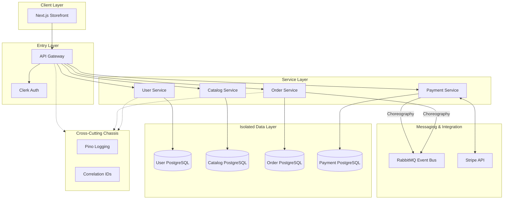
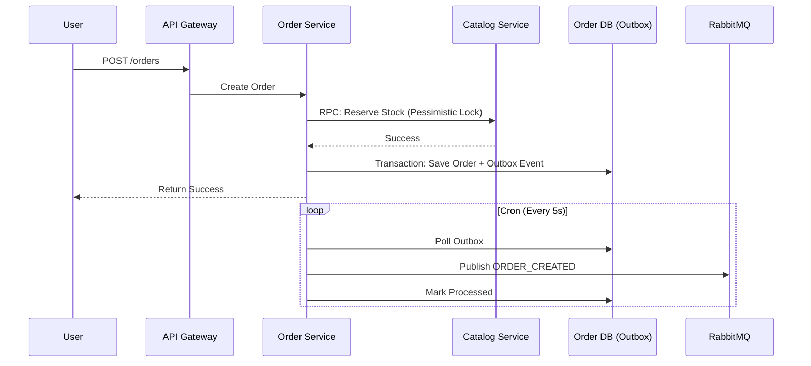

# 🛒 Modular Mart (E-Commerce Microservices)

## 🧠 System Overview
Modular Mart is a cloud-native, microservices-based e-commerce platform designed with a focus on **domain isolation**, **event-driven choreography**, and **observability**.

- **API Gateway**: The single entry point using NestJS, handling routing, rate limiting, and auth verification.
- **User Service**: Manages identity and profiles, synced with **Clerk**.
- **Catalog Service**: Manages product inventory and pricing.
- **Order Service**: The core domain managing orders and the **Outbox-based checkout process**.
- **Payment Service**: Handles Stripe payments and webhooks.
- **Web Frontend**: A modern Next.js storefront using a shared headless UI system.
- **Shared Chassis**: A set of internal packages (`@mart/auth`, `@mart/common`) providing consistent logging and tracing across all services.

---

## 🏗 System Architecture
The system follows the **Database-per-Service** and **Microservice Chassis** patterns to ensure high decoupling and consistency.



---

## 🔄 Core Architectural Patterns

### 1. Synchronous Request/Reply & Outbox Pattern (Checkout)
Checkout is handled through a mature, distributed workflow combining synchronous RPC and the Outbox Pattern to guarantee consistency without the chaos of eventual consistency:



### 2. Microservice Chassis
All services inherit standard behavior from the `packages/` directory:
- **Tracing**: Every request is tagged with a `Correlation ID` that persists across service boundaries.
- **Logging**: Structured JSON logging via **Pino** for log aggregation.
- **Health**: Standardized `/health` endpoints for liveness and readiness probes.

### 3. Database Isolation
Each microservice owns its schema and database instance. No service can directly query another service's database, ensuring that schema changes in one domain do not break others. The `Order Service` now strictly manages only orders, items, and outbox events, without importing external catalog entities.

---

## 📁 Engineering & Project Structure

Managed via **Turborepo**, the codebase is optimized for sharing types and logic without tight coupling.

```text
e-commerce-microservices/
├── apps/
│   ├── api-gateway/            # Entry point & Proxy logic
│   ├── catalog-service/        # Inventory and products
│   ├── order-service/          # Order management & checkout
│   ├── payment-service/        # Stripe payments
│   ├── user-service/           # Identity & Profile management
│   └── web/                    # Storefront (Headless UI architecture)
├── packages/
│   ├── auth/                   # Shared Clerk guards & RBAC
│   ├── common/                 # Microservice Chassis (Logging, Tracing, Filters)
│   ├── contracts/              # Event schemas & DTOs
│   ├── database/               # Shared TypeORM abstractions
│   └── ui/                     # Design System (Tailwind + cn utility)
```

---

## 🛠 Tech Stack & Tools

- **Backend**: NestJS, TypeORM, PostgreSQL
- **Frontend**: Next.js 14, Tailwind CSS, Shadcn UI
- **Messaging**: RabbitMQ (Asynchronous Choreography)
- **Identity**: Clerk (Offloaded Authentication)
- **Payments**: Stripe (Client-side confirmation + Webhooks)
- **Infrastructure**: Docker, Turborepo, Render

---

## 🎯 Design Decisions (Verified by Graphify)
- **Atomic UI**: The frontend uses a `cn()` utility as a bridge node to maintain styling consistency across disparate UI components.
- **Pessimistic Locking**: Crucial for the `Catalog Service` to prevent overselling during high-concurrency checkout windows.
- **Environment Safety**: Centralized Zod-based validation for all environment variables at service bootstrap.

