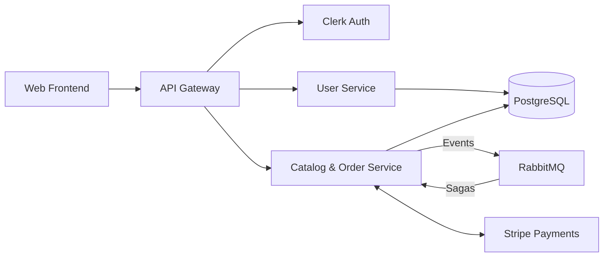
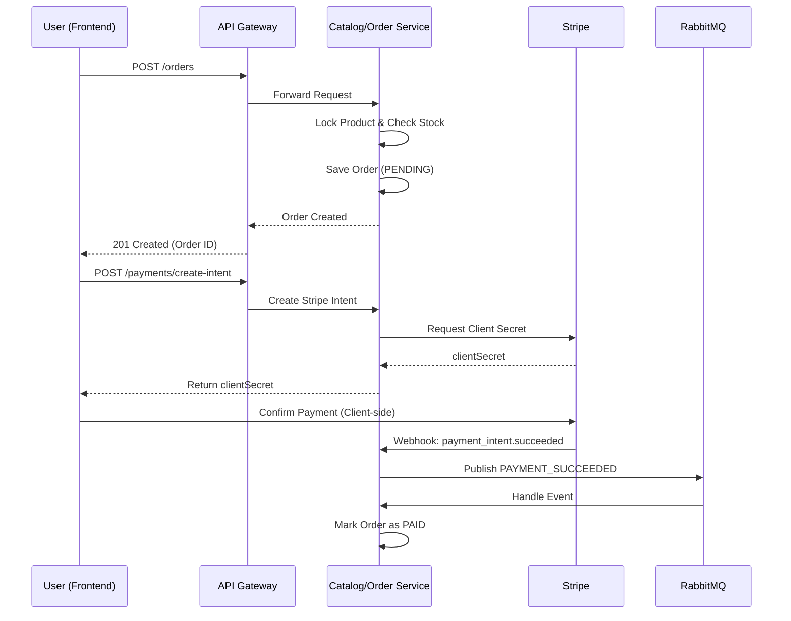

# 🛒 Modular Mart (E-Commerce Microservices)

## 🧠 System Overview
A microservices-based e-commerce platform where:

- **API Gateway** handles incoming requests, routing, and security.
- **User Service** manages user profiles and preferences.
- **Catalog & Order Service** processes product inventory, checkout, and integrates with **Stripe** for payments.
- **Next.js Web App** serves as the customer-facing storefront.
- **PostgreSQL** stores structured application data.
- **RabbitMQ** enables asynchronous, event-driven communication (e.g., `PAYMENT_SUCCEEDED`).
- **Clerk** handles authentication and identity management.

> Services communicate via REST for synchronous reads/writes, and via RabbitMQ for asynchronous event choreography.

---

## 🏗 Architecture Diagram


---

## 🔄 Request Flow (Checkout & Payment)


---

## 🧩 Services

| Service / App | Responsibility | Tech Stack |
| --- | --- | --- |
| **API Gateway** | Routing, auth verification, request forwarding | NestJS |
| **Web** | Customer-facing storefront | Next.js, React, Tailwind |
| **User Service** | User profile management | NestJS, PostgreSQL |
| **Catalog/Order Service** | Product management, orders, Stripe payments | NestJS, PostgreSQL, Stripe |
| **Database** | Core data storage | PostgreSQL |
| **Message Broker** | Asynchronous event processing | RabbitMQ |

---

## 📁 Project Structure

```text
e-commerce-microservices/
├── apps/
│   ├── api-gateway/            # Central entry point for client requests
│   ├── catalog-order-service/  # Manages products, orders, and payments
│   ├── user-service/           # Manages user profiles
│   ├── web/                    # Next.js storefront
│   └── docs/                   # Next.js documentation site
├── packages/
│   ├── auth/                   # Shared Clerk auth guards and utilities
│   ├── common/                 # Shared logging, middlewares, filters
│   ├── contracts/              # Shared RabbitMQ event payloads and patterns
│   ├── database/               # Shared TypeORM config and migrations
│   └── ui/                     # Shared React components
└── turbo.json                  # Turborepo build pipeline configuration
```

---

## 🎯 Design Decisions
- **Monorepo (Turborepo)**: Simplifies code sharing (DTOs, interfaces, UI components) across services while maintaining independent build pipelines.
- **Event-Driven Microservices**: Uses RabbitMQ for event-driven patterns to decouple domains (e.g., separating payment fulfillment from order status updates).
- **Pessimistic Database Locking**: Prevents race conditions during checkout (e.g., overselling a product) by using row-level locks via TypeORM.
- **Offloaded Authentication**: Uses Clerk to offload the complexity of credential management, password resets, and session handling.
