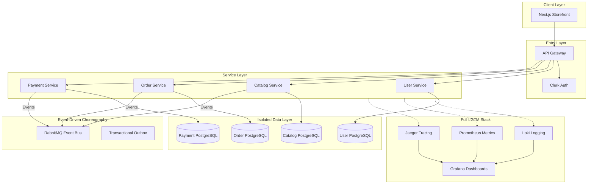
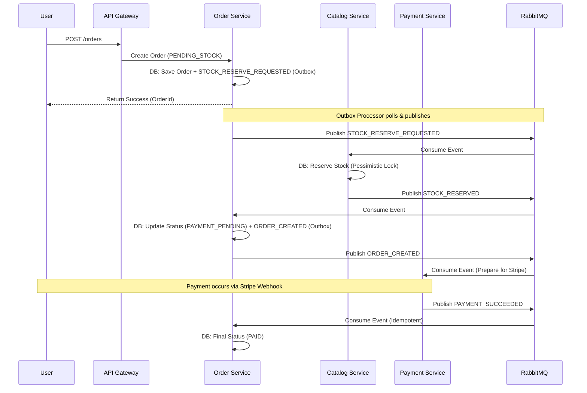

# 🛒 Modular Mart (E-Commerce Microservices)

## 🧠 System Overview
Modular Mart is a cloud-native, microservices-based e-commerce platform designed with a focus on **domain isolation**, **event-driven choreography**, and **deep observability**.

- **API Gateway**: The single entry point using NestJS, handling routing, rate limiting, and auth verification.
- **User Service**: Manages identity and profiles, synced with **Clerk**.
- **Catalog Service**: Manages product inventory and pricing.
- **Order Service**: The core domain managing orders and the **Transactional Outbox-based checkout saga**.
- **Payment Service**: Handles Stripe payments and webhooks.
- **Web Frontend**: A modern Next.js storefront using a shared headless UI system.
- **Shared Chassis**: Internal packages (`@mart/auth`, `@mart/common`) providing consistent logging and tracing.

---

## 🏗 System Architecture
The system follows the **Database-per-Service** and **Microservice Chassis** patterns, now enhanced with a full **LGTM** observability stack.



---

## 🔄 Core Architectural Patterns

### 1. Choreographed Saga & Outbox Pattern (Checkout)
Checkout is handled through an asynchronous **Choreographed Saga** combined with the **Transactional Outbox Pattern** to guarantee consistency without the chaos of eventual consistency:



### 2. Microservice Chassis
All services inherit standard behavior from the `packages/` directory:
- **Tracing**: Every request is tagged with a `Correlation ID` that persists across service boundaries.
- **Logging**: Structured JSON logging via **Pino** for log aggregation.
- **Health**: Standardized `/health` endpoints for liveness and readiness probes.

### 3. Full-Stack Observability
We implement the **LGTM** (Loki, Grafana, Prometheus, Jaeger) stack for deep visibility:
- **Loki**: Log aggregation with shared labels for centralized searching.
- **Jaeger**: Distributed tracing to visualize the life of a request across HTTP and RabbitMQ boundaries.
- **Prometheus**: Scraping `/metrics` for real-time performance, throughput, and error rates.
- **Grafana**: Unified dashboards combining logs, metrics, and traces into a single pane of glass.

---

## 📁 Engineering & Project Structure

Managed via **Turborepo**, the codebase is optimized for sharing types and logic without tight coupling.

```text
e-commerce-microservices/
├── apps/
│   ├── api-gateway/            # Entry point & Proxy logic
│   ├── catalog-service/        # Inventory and products
│   ├── order-service/          # Order management & checkout saga
│   ├── payment-service/        # Stripe payments
│   ├── user-service/           # Identity & Profile management
│   └── web/                    # Storefront (Headless UI architecture)
├── packages/
│   ├── auth/                   # Shared Clerk guards & RBAC
│   ├── common/                 # Microservice Chassis (Logging, Tracing, Filters)
│   ├── contracts/              # Event schemas & DTOs (The Source of Truth)
│   ├── database/               # Shared TypeORM abstractions
│   └── ui/                     # Design System (Tailwind + cn utility)
```

---

## 🛠 Tech Stack & Tools

- **Backend**: NestJS, TypeORM, PostgreSQL
- **Frontend**: Next.js 14, Tailwind CSS, Shadcn UI
- **Messaging**: RabbitMQ (Asynchronous Choreography)
- **Identity**: Clerk (Offloaded Authentication)
- **Payments**: Stripe (Client-side confirmation + Webhooks)
- **Observability**: Loki, Prometheus, Grafana, Jaeger
- **Infrastructure**: Docker, Turborepo, Render

---

## 🎯 Design Decisions (Verified by Graphify)
- **Atomic UI**: The frontend uses a `cn()` utility as a bridge node to maintain styling consistency.
- **Pessimistic Locking**: Crucial for the `Catalog Service` to prevent overselling during high-concurrency checkout windows.
- **Environment Safety**: Centralized Zod-based validation for all environment variables at service bootstrap.

---

## 🏛 Architectural & Technical Decisions Justified

### 1. Bounded Context Isolation (Microservices vs. Monolith)
*   **Why**: Monolithic setups lead to a "spaghetti" of dependencies over time. In Modular Mart, domain logic for **Catalog**, **Orders**, **Payments**, and **Users** is cleanly split into individual microservices.
*   **Justification**: This ensures **failure isolation** (e.g., if the `payment-service` experiences degradation, users can still browse the catalog) and allows each service to scale independently.

### 2. Database-per-Service Pattern
*   **Why**: Having services share a single database or directly join tables compromises domain boundaries.
*   **Justification**: Each service has its own dedicated PostgreSQL schema. Communication strictly happens via public APIs (HTTP or RPC/Events), preventing schema changes in one domain from breaking other services.

### 3. Transactional Outbox Pattern for Event Publishing
*   **Why**: Executing a database write and publishing an event to a broker in the same block can lead to inconsistent states if one fails (the **dual-write problem**).
*   **Justification**: We use the **Outbox Pattern**. When a user creates an order, the `order` record and an `outbox_events` record are saved in the same local database transaction. A background worker publishes the events and marks them as processed upon success, guaranteeing **at-least-once event delivery**.

### 4. Pessimistic Locking for Inventory Reservation
*   **Why**: We use database **pessimistic locks** (`SELECT ... FOR UPDATE`) in the `Catalog Service` during the reservation phase of the saga.
*   **Justification**: Stock reservation must be highly consistent and immediate. If stock was reserved asynchronously without locking, high-concurrency "flash sales" would result in massive overselling. By synchronously locking the product row during the reservation event processing, we guarantee inventory integrity at the cost of a lightweight lock duration.

### 5. Idempotent Consumer Pattern (`processed_messages` Table)
*   **Why**: Because RabbitMQ guarantees at-least-once delivery, consumers can receive the same message multiple times (e.g., during a network drop after processing but before acknowledgment).
*   **Justification**: To achieve **exactly-once processing semantics**, we implemented a `processed_messages` table. Every event (like `PAYMENT_SUCCEEDED`) is deduplicated by its unique message ID within the same transaction that updates the domain state.

### 6. Turborepo Monorepo & Microservice Chassis
*   **Why**: Operating multiple separate code repositories increases overhead and makes contract/DTO sharing difficult.
*   **Justification**: We use Turborepo to host all services in one place. Crucially, we implemented a **Microservice Chassis** in the `packages/` directory to enforce consistency in logging, tracing, and contracts across the entire system.

### 7. Selected Technologies (The LGTM Stack)
*   **NestJS**: Provides structural consistency and native support for hybrid microservices (HTTP + RMQ).
*   **PostgreSQL**: Selected for its mature reliability and advanced concurrency controls (essential for pessimistic locking).
*   **LGTM Stack**: Chosen for its ability to provide a "single pane of glass" for observability, allowing us to trace a single request from the API Gateway, through RabbitMQ, into a downstream service's database call, and finally to its logs.
