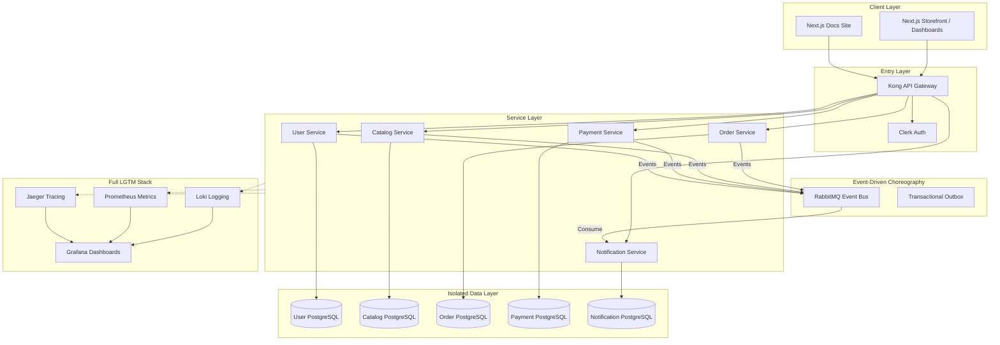
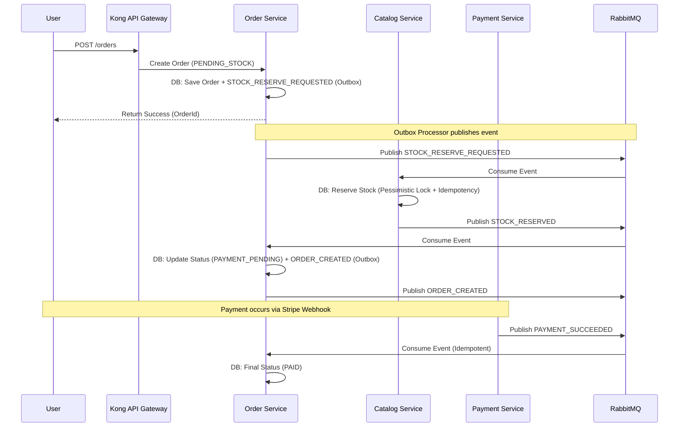

# 🛒 Modular Mart (E-Commerce Microservices)

## 🧠 System Overview
Modular Mart is a cloud-native, microservices-based e-commerce platform designed with a focus on **domain isolation**, **event-driven choreography**, and **deep observability**. It has evolved from a single-vendor store into a full **multi-vendor marketplace**.

- **API Gateway**: The single entry point using **Kong**, handling routing, rate limiting, and auth verification. A NestJS-based gateway exists as a legacy alternative.
- **User Service**: Manages identity and profiles, synced with **Clerk**.
- **Catalog Service**: Manages product inventory, categories, and **seller product approvals**.
- **Order Service**: Core domain managing orders, seller-specific splits, and the **Transactional Outbox-based saga**.
- **Payment Service**: Handles Stripe payments, webhooks, and asynchronous payment status updates.
- **Notification Service**: A robust multi-channel notification engine (Email, SMS, Push, In-App) with **real-time SSE updates**.
- **Web Frontend**: A modern Next.js storefront with dedicated **Customer** and **Seller** dashboards.
- **Docs**: A Next.js-based documentation site providing developer guides and API references.

---

## 🏗 System Architecture
The system follows the **Database-per-Service** and **Microservice Chassis** patterns, fully integrated with the **LGTM** observability stack.



---

## 🔄 Core Architectural Patterns

### 1. Choreographed Saga & Outbox Pattern (Checkout)
Checkout is handled through an asynchronous **Choreographed Saga** combined with the **Transactional Outbox Pattern**. This guarantees that database changes and event publishing are atomic.

**Order States:** `PENDING_STOCK` → `PAYMENT_PENDING` → `PAID` → `SHIPPED` → `DELIVERED`



### 2. Microservice Chassis
All services inherit standard behavior from the `packages/` directory:
- **Tracing**: Every request is tagged with an `X-Request-ID` (Correlation ID) that persists across HTTP and RabbitMQ boundaries.
- **Logging**: Structured JSON logging via **nestjs-pino** for centralized aggregation.
- **Idempotency**: All event consumers use a `processed_messages` table to ensure **Exactly-Once** processing semantics.
- **Health**: Standardized `/health/live` and `/health/ready` endpoints.

### 3. Full-Stack Observability (LGTM)
We implement the full **LGTM** stack for deep system visibility:
- **Loki**: Log aggregation with container-level metadata.
- **Grafana**: Unified dashboards combining logs, metrics, and traces.
- **Prometheus**: Metrics scraping for performance and health monitoring.
- **Jaeger**: Distributed tracing to visualize request flow across the entire microservice web.

---

## 🛡️ Resiliency & Reliability

Modular Mart is designed for production-grade stability:
- **Dead Letter Queues (DLQ)**: Failed messages are automatically routed to DLQs after retries are exhausted to prevent pipeline stalls.
- **Exponential Backoff**: Transient failures (like database hiccups) are handled via a custom retry decorator with increasing delays (1s, 2s, 4s).
- **Compensating Transactions**: The Checkout Saga automatically "rolls back" stock reservations if a downstream payment fails.
- **Idempotent Consumers**: Every event handler uses a `processed_messages` guard to guarantee **Exactly-Once** side effects.
- **Pessimistic Locking**: Prevents inventory overselling by locking product rows during the reservation window.

---

## 📁 Engineering & Project Structure

Managed via **Turborepo**, the codebase is optimized for sharing types and logic without tight coupling.

```text
e-commerce-microservices/
├── apps/
│   ├── api-gateway/            # Legacy NestJS-based gateway
│   ├── catalog-service/        # Products, Inventory, & Categories
│   ├── docs/                   # Developer documentation site
│   ├── kong-gateway/           # Primary API Gateway
│   ├── order-service/          # Order lifecycle & Saga coordination
│   ├── payment-service/        # Stripe integration & webhooks
│   ├── notification-service/   # Multi-channel (SSE, Email, SMS)
│   ├── user-service/           # Identity & Clerk sync
│   └── web/                    # Storefront & Dashboards (Customer/Seller/Admin)
├── packages/
│   ├── auth/                   # Shared Clerk guards & Roles logic
│   ├── common/                 # Chassis (Logging, Tracing, Health, Metrics)
│   ├── contracts/              # Shared DTOs & Event Patterns (Source of Truth)
│   ├── database/               # Shared TypeORM config
│   ├── eslint-config/          # Shared ESLint configuration
│   ├── shared-types/           # Shared TypeScript types and interfaces
│   ├── typescript-config/      # Shared tsconfig.json files
│   └── ui/                     # Design System (Tailwind + Shadcn)
```

---

## 🛠 Tech Stack & Tools

- **Backend**: NestJS, TypeORM, PostgreSQL, RabbitMQ
- **Frontend**: Next.js 14 (App Router), Tailwind CSS, Shadcn UI
- **API Gateway**: Kong
- **Observability**: Loki, Prometheus, Grafana, Jaeger
- **Identity**: Clerk (Auth-as-a-Service)
- **Payments**: Stripe (Elements + Webhooks)
- **Infrastructure**: Docker, Turborepo, Render
