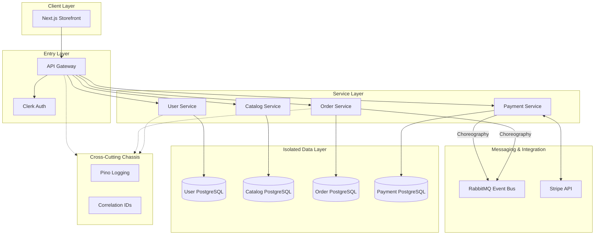
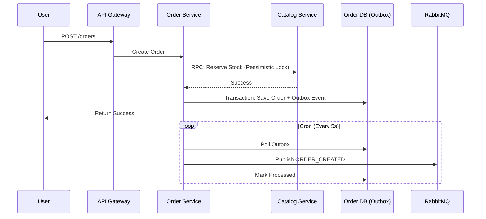

# 🛒 Modular Mart (E-Commerce Microservices)

## 🧠 System Overview
Modular Mart is a cloud-native, microservices-based e-commerce platform designed with a focus on **domain isolation**, **event-driven choreography**, and **observability**.

- **API Gateway**: The single entry point using NestJS, handling routing, rate limiting, and auth verification.
- **User Service**: Manages identity and profiles, synced with **Clerk**.
- **Catalog Service**: Manages product inventory and pricing.
- **Order Service**: The core domain managing orders and the **Outbox-based checkout process**.
- **Payment Service**: Handles Stripe payments and webhooks.
- **Web Frontend**: A modern Next.js storefront using a shared headless UI system.
- **Shared Chassis**: A set of internal packages (`@mart/auth`, `@mart/common`) providing consistent logging and tracing across all services.

---

## 🏗 System Architecture
The system follows the **Database-per-Service** and **Microservice Chassis** patterns to ensure high decoupling and consistency.



---

## 🔄 Core Architectural Patterns

### 1. Synchronous Request/Reply & Outbox Pattern (Checkout)
Checkout is handled through a mature, distributed workflow combining synchronous RPC and the Outbox Pattern to guarantee consistency without the chaos of eventual consistency:



### 2. Microservice Chassis
All services inherit standard behavior from the `packages/` directory:
- **Tracing**: Every request is tagged with a `Correlation ID` that persists across service boundaries.
- **Logging**: Structured JSON logging via **Pino** for log aggregation.
- **Health**: Standardized `/health` endpoints for liveness and readiness probes.

### 3. Database Isolation
Each microservice owns its schema and database instance. No service can directly query another service's database, ensuring that schema changes in one domain do not break others. The `Order Service` now strictly manages only orders, items, and outbox events, without importing external catalog entities.

---

## 📁 Engineering & Project Structure

Managed via **Turborepo**, the codebase is optimized for sharing types and logic without tight coupling.

```text
e-commerce-microservices/
├── apps/
│   ├── api-gateway/            # Entry point & Proxy logic
│   ├── catalog-service/        # Inventory and products
│   ├── order-service/          # Order management & checkout
│   ├── payment-service/        # Stripe payments
│   ├── user-service/           # Identity & Profile management
│   └── web/                    # Storefront (Headless UI architecture)
├── packages/
│   ├── auth/                   # Shared Clerk guards & RBAC
│   ├── common/                 # Microservice Chassis (Logging, Tracing, Filters)
│   ├── contracts/              # Event schemas & DTOs
│   ├── database/               # Shared TypeORM abstractions
│   └── ui/                     # Design System (Tailwind + cn utility)
```

---

## 🛠 Tech Stack & Tools

- **Backend**: NestJS, TypeORM, PostgreSQL
- **Frontend**: Next.js 14, Tailwind CSS, Shadcn UI
- **Messaging**: RabbitMQ (Asynchronous Choreography)
- **Identity**: Clerk (Offloaded Authentication)
- **Payments**: Stripe (Client-side confirmation + Webhooks)
- **Infrastructure**: Docker, Turborepo, Render

---

## 🎯 Design Decisions (Verified by Graphify)
- **Atomic UI**: The frontend uses a `cn()` utility as a bridge node to maintain styling consistency across disparate UI components.
- **Pessimistic Locking**: Crucial for the `Catalog Service` to prevent overselling during high-concurrency checkout windows.
- **Environment Safety**: Centralized Zod-based validation for all environment variables at service bootstrap.

---

## 🏛 Architectural & Technical Decisions Justified

Here is the deep-dive technical reasoning behind the architectural choices and stack selections for **Modular Mart**:

### 1. Bounded Context Isolation (Microservices vs. Monolith)
*   **Why**: Monolithic setups lead to a "spaghetti" of dependencies over time. In Modular Mart, domain logic for **Catalog**, **Orders**, **Payments**, and **Users** is cleanly split into individual microservices.
*   **Justification**: This ensures **failure isolation** (e.g., if the `payment-service` experiences degradation due to Stripe API issues, users can still browse the catalog) and allows each service to scale independently based on demand.

### 2. Database-per-Service Pattern
*   **Why**: Having services share a single database or directly join tables compromises domain boundaries.
*   **Justification**: Each service has its own dedicated PostgreSQL schema. Communication strictly happens via public APIs (HTTP or RPC/Events). If `order-service` needs product details, it queries `catalog-service` rather than querying a `products` table directly, which prevents schema changes in one domain from breaking other services.

### 3. Synchronous RPC for Inventory Reservation
*   **Why**: We chose a synchronous **Request/Reply** pattern via RabbitMQ TCP Client for stock locking instead of an asynchronous eventual consistency model.
*   **Justification**: Stock reservation during checkout must be highly consistent and immediate. If stock was reserved asynchronously, high-concurrency "flash sales" would result in massive overselling. By synchronously calling `products.reserve_stock` (using database **pessimistic locks** under the hood in `catalog-service`) inside the checkout transaction, we guarantee inventory integrity at the cost of a lightweight HTTP-to-RPC call.

### 4. Transactional Outbox Pattern for Event Publishing
*   **Why**: A standard anti-pattern in microservices is executing a database write and publishing an event to a broker like RabbitMQ in the same block. If the network drops or RabbitMQ is down, the DB transaction commits but the event is lost (the **dual-write problem**).
*   **Justification**: We use the **Outbox Pattern**. When a user creates an order, the `order` record and an `outbox_events` record are saved in the same local database transaction. A background cron-worker (`outbox-processor`) queries the table every 5 seconds, publishes the events, and marks them as processed upon success. This guarantees **at-least-once event delivery** even if RabbitMQ undergoes a temporary outage.

### 5. Idempotent Consumer Pattern (`processed_messages` Table)
*   **Why**: Because RabbitMQ guarantees at-least-once delivery, consumers can receive the same message multiple times (e.g. during a network drop between broker and consumer after processing but before acknowledgment).
*   **Justification**: To achieve **exactly-once processing semantics**, we implemented a `processed_messages` table. When `order-service` receives `PAYMENT_SUCCEEDED`, it uses the `paymentId` as a unique deduplication key. The check and insert of this key are bound to the same database transaction that updates the order status to `PAID`. If a redelivered event arrives, it fails the primary key constraint or is bypassed, eliminating duplicate operations (like sending double confirmation emails).

### 6. Turborepo Monorepo & Microservice Chassis
*   **Why**: Operating multiple separate code repositories increases overhead, makes contract/DTO sharing difficult, and leads to code duplication across services (logging, auth, etc.).
*   **Justification**: We use Turborepo to host all services in one place. Crucially, we implemented a **Microservice Chassis** in the `packages/` directory:
    *   `@mart/common` enforces consistent JSON logging (Pino), error handling, and distributed correlation tracking across all services.
    *   `@mart/contracts` shares unified API contracts, DTO types, and event schemas, ensuring compile-time safety across service boundaries.
    *   `@mart/database` centralizes PostgreSQL TypeORM configurations.

### 7. Selected Technologies
*   **NestJS**: Provides Angular-like dependency injection and structural consistency. Its native support for hybrid microservices makes setting up RabbitMQ TCP listeners straightforward and type-safe.
*   **PostgreSQL**: Selected for its mature reliability, strong ACID compliance, and advanced concurrency controls (e.g. `SELECT ... FOR UPDATE` for stock reservation).
*   **RabbitMQ**: Unlike Kafka, which is designed for event-streaming/log replays, RabbitMQ is ideal for fast, lightweight traditional queueing, point-to-point RPC request-reply, and immediate event-driven choreography.
*   **Clerk & Auth Gateway**: Authentication is offloaded to Clerk for enterprise-grade security (OAuth, MFA). The NestJS `api-gateway` validates the incoming JWT statelessly in one place and injects parsed identity claims into headers for downstream services, keeping other microservices stateless and lightweight.


