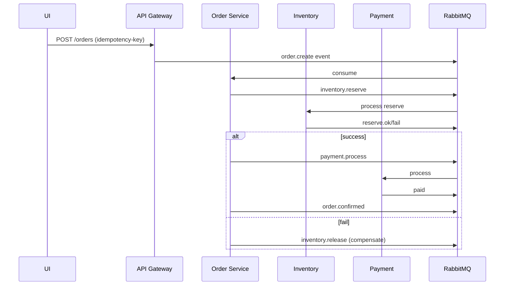
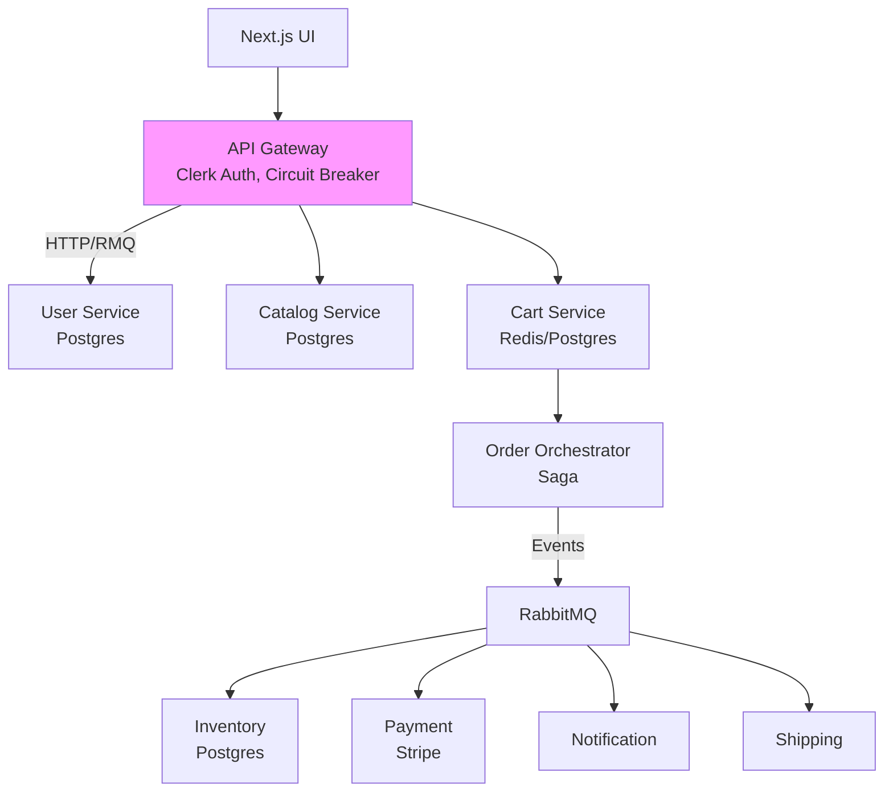

This is a [Next.js](https://nextjs.org) project bootstrapped with [`create-next-app`](https://nextjs.org/docs/app/api-reference/create-next-app).

## Getting Started

First, run the development server:

```bash
npm run dev
# or
yarn dev
# or
pnpm dev
# or
bun dev
```

Open [http://localhost:3000](http://localhost:3000) with your browser to see the result.

You can start editing the page by modifying `app/page.tsx`. The page auto-updates as you edit the file.

This project uses [`next/font`](https://nextjs.org/docs/app/building-your-application/optimizing/fonts) to automatically optimize and load Inter, a custom Google Font.

## Learn More

To learn more about Next.js, take a look at the following resources:

- [Next.js Documentation](https://nextjs.org/docs) - learn about Next.js features and API.
- [Learn Next.js](https://nextjs.org/learn) - an interactive Next.js tutorial.

You can check out [the Next.js GitHub repository](https://github.com/vercel/next.js) - your feedback and contributions are welcome!

## Deploy on Vercel

The easiest way to deploy your Next.js app is to use the [Vercel Platform](https://vercel.com/new?utm_medium=default-template&filter=next.js&utm_source=create-next-app&utm_campaign=create-next-app-readme) from the creators of Next.js.

Check out our [Next.js deployment documentation](https://nextjs.org/docs/app/building-your-application/deploying) for more details.

# E-Commerce Microservices Roadmap

Your NestJS-based e-commerce app with API Gateway, Catalog-Order, User services, RabbitMQ orchestration, Clerk auth, and per-service Postgres is a solid foundation. Here's a complete production roadmap covering flows, patterns, edge cases, and remaining components to reach average production readiness. [github](https://github.com/maharshi66/nestjs-ecommerce)

## Core User Flows

### Authentication Flow
User logs in via UI → API Gateway validates Clerk JWT → Forwards to User Service (via RabbitMQ or TCP) for profile fetch → Returns user data with roles. [github](https://github.com/mahdi-vajdi/nestjs-microservice-example)

Gateway handles token refresh, revocation checks. Edge case: Invalid/expired token → 401 response, circuit breaker prevents User Service overload. [blog.bitsrc](https://blog.bitsrc.io/implementing-circuit-breaker-pattern-in-a-microservices-based-application-5d759021d09a)

Saga not needed here; use stateless JWT validation.

### Browse & Cart Flow
Login → Fetch products (Gateway → Catalog Service) → Add to cart (Gateway → Cart Service, client-side or server cart with Redis). [github](https://github.com/maharshi66/nestjs-ecommerce)

Persist cart in Cart Service Postgres on add/update. Edge case: Out-of-stock during session → Real-time inventory check via event from Inventory Service.

### Order Placement Flow (Saga Orchestration)
1. UI sends cart → Gateway (auth + idempotency key) → Order Service via RabbitMQ "order.create".
2. Order Service: Validates user/cart, reserves inventory (event to Inventory), processes payment (event to Payment).
3. Success: Confirms order, notifies via Notification Service.
4. Failure: Compensating transactions (release inventory, refund payment intent). [blog.devops](https://blog.devops.dev/rabbitmq-part-2-implementing-the-saga-orchestrator-pattern-in-microservices-with-rabbitmq-and-234c9fe1c1d5)

Idempotency: Client sends unique key; Order Service checks Redis/Postgres for existing order ID. [linkedin](https://www.linkedin.com/pulse/designing-idempotent-microservices-avoiding-duplicate-amit-jindal-wwgcf)



### Payment Flow (Remaining)
Post-order saga step: Payment Service integrates Stripe/Razorpay (India-friendly), creates intent with idempotency key → Webhook confirms → Event to Order for status update. [strapi](https://strapi.io/blog/ecommerce-microservices-architecture-benefits-guide)

Edge case: Payment timeout → Saga compensates (release inventory); use outbox pattern for reliable events. [youtube](https://www.youtube.com/watch?v=hubLx-wgnRM)

## Key Engineering Patterns

### Circuit Breaker
Implement in API Gateway/NestJS services using `@nestjs/terminus` or `opossum` lib: Track failures to downstream (e.g., Inventory), open circuit after 5 fails/10s → Fallback (e.g., cached products). [linkedin](https://www.linkedin.com/pulse/prevent-microservice-failures-nestjs-circuit-breaker-pattern-cod-hko6c)

NestJS code: Wrap HTTP/RMQ calls in circuit breaker observable.

### Idempotency
Gateway generates/stores key (Redis TTL 24h) → Passes to services. Order Service: `SELECT order WHERE idemp_key = ?` → Return existing or create new. [linkedin](https://www.linkedin.com/posts/ajit-samanta_systemdesign-microservices-distributedsystems-activity-7420828125908992000-I4gq)

### Saga Orchestration (RabbitMQ)
Order Service as orchestrator: Publishes commands (reserve/pay), consumes replies, triggers compensators on fail. Dead-letter queues for retries. [blog.devops](https://blog.devops.dev/rabbitmq-part-2-implementing-the-saga-orchestrator-pattern-in-microservices-with-rabbitmq-and-234c9fe1c1d5)

### Other Patterns
- **Outbox**: Transactional DB writes + poll/publish events reliably. [youtube](https://www.youtube.com/watch?v=hubLx-wgnRM)
- **Bulkhead**: Limit concurrent calls per service (e.g., semaphore in NestJS). [dev](https://dev.to/geampiere/mastering-microservices-patterns-circuit-breaker-fallback-bulkhead-saga-and-cqrs-4h55)
- **Retry**: Exponential backoff on RMQ consumer rejects.

## Edge Cases & Handling

| Scenario | Impact | Engineering Solution |
|----------|--------|----------------------|
| Inventory race condition | Oversell | Optimistic locking (version in Postgres) + reserve saga step. [reddit](https://www.reddit.com/r/softwarearchitecture/comments/1fv9539/ecommerce_microservice_communication/) |
| Network partition | Partial order | Saga timeout + compensators; distributed locks (Redis). [dev](https://dev.to/geampiere/mastering-microservices-patterns-circuit-breaker-fallback-bulkhead-saga-and-cqrs-4h55) |
| Payment gateway fail | Stuck orders | Webhook retry queue; manual dashboard in Admin Service. |
| High traffic flash sale | Service overload | Rate limiting in Gateway, auto-scale (K8s), cache (Redis). |
| Duplicate events | Double processing | Consumer idempotency via event ID in RMQ headers. |
| Data inconsistency | Lost events | Exactly-once delivery via RMQ confirmations + outbox. |

## Missing Services (Production Must-Haves)

- **Inventory Service**: Stock management, low-stock alerts via events. [reddit](https://www.reddit.com/r/softwarearchitecture/comments/1fv9539/ecommerce_microservice_communication/)
- **Cart Service**: Session carts (Redis + Postgres sync). [github](https://github.com/maharshi66/nestjs-ecommerce)
- **Payment Service**: Gateways, refunds, webhooks. [strapi](https://strapi.io/blog/ecommerce-microservices-architecture-benefits-guide)
- **Notification Service**: Email/SMS (e.g., Nodemailer + queue). [github](https://github.com/maharshi66/nestjs-ecommerce)
- **Shipping Service**: Carrier integration (e.g., Shiprocket for India), tracking.
- **Admin Service**: Dashboards, analytics (separate auth).

Per-service Postgres + shared Redis for cache/cross-service.

## Frontend Completion
Extend products UI (Next.js?): Cart view, checkout form, order history. Use TanStack Query for optimistic updates.[user-information]

Real-time: Socket.io via Gateway for stock/order updates.

## Production Checklist

### Observability
- Logging: Winston + ELK stack.
- Metrics: Prometheus + Grafana.
- Tracing: Jaeger/OpenTelemetry across services.

### Deployment
- Docker Compose → Kubernetes/Turborepo.[user-information]
- CI/CD: GitHub Actions, Helm charts.
- Secrets: Vault or env vars.

### Security
- Clerk scopes in Gateway.
- mTLS between services.
- SQL injection via TypeORM params.

### Testing
- Unit: Jest per service.
- Integration: Testcontainers for Postgres/RMQ.
- Contract: Pact for API evolutions.
- Load: Artillery on Gateway.

## Architecture Diagram



Implement in phases: Inventory/Cart first, then Payment Saga. This gets you to production-grade handling 10k+ orders/day. [youtube](https://www.youtube.com/watch?v=WLis71xjks8)