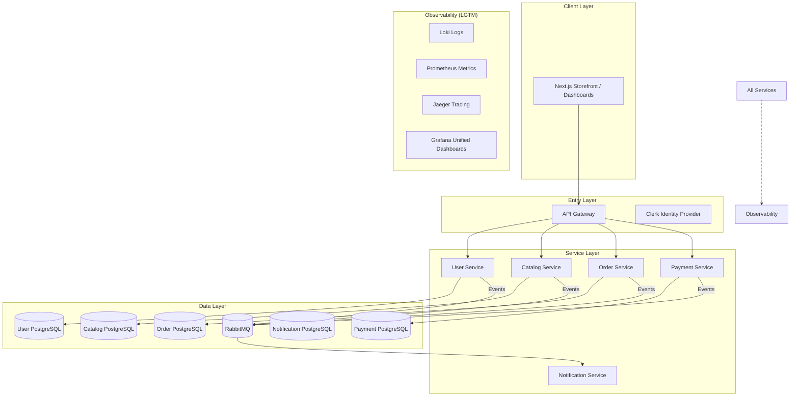
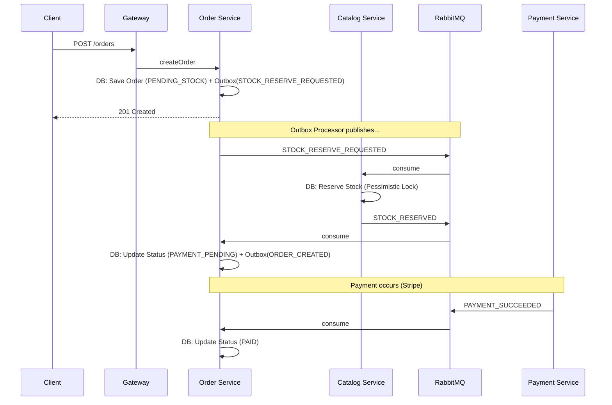

# Modular Mart - System Design

## Architecture Overview

Modular Mart implements a production-grade microservices architecture centered on **domain autonomy**, **asynchronous choreography**, and **deep observability**.

## Services/Modules

### 1. API Gateway (NestJS)
- **Reverse Proxy**: Routes traffic to downstream services based on path prefixes.
- **Security**: Enforces rate limiting and global authentication guards.
- **Correlation**: Injects `X-Request-ID` into every request for distributed tracing.

### 2. User Service (NestJS + TypeORM)
- **Profile Management**: Stores user metadata synced from Clerk via webhooks.
- **Address Book**: Manages shipping and billing entities.
- **RBAC**: Source of truth for user roles (Customer, Seller, Admin).

### 3. Catalog Service (NestJS + TypeORM)
- **Product Domain**: Manages products, categories, and inventory.
- **Inventory Locking**: Implements **Pessimistic Locking** (`SELECT FOR UPDATE`) to ensure consistency during reservations.
- **Marketplace Logic**: Handles product approval workflows for sellers.

### 4. Order Service (NestJS + TypeORM)
- **Saga Coordination**: Orchestrates the checkout flow using events.
- **Outbox Pattern**: Uses a `outbox_events` table to guarantee atomic publishing of business events.
- **Splitting**: Automatically handles orders containing items from multiple sellers.

### 5. Payment Service (NestJS + Stripe)
- **Stripe Integration**: Creates PaymentIntents and processes webhooks.
- **Idempotency**: Deduplicates Stripe events to prevent double-processing.

### 6. Notification Service (NestJS + SSE)
- **Engines**: Email (Nodemailer) and Real-time SSE (Server-Sent Events).
- **Templates**: Handlebars-based dynamic templates.
- **Preferences**: Fine-grained user controls for channel delivery.

## Communication & Patterns

### Transactional Outbox (Checkout Example)
1. **Order Service** saves an Order and a `STOCK_RESERVE_REQUESTED` event in a single database transaction.
2. **Outbox Processor** (background worker) polls the table and publishes the event to RabbitMQ.
3. This ensures that if the database write succeeds, the event is guaranteed to be published eventually.

### Choreographed Saga Flow

## Resiliency & Fault Tolerance

Modular Mart is built to handle the inherent failures of distributed systems using several advanced patterns:

### 1. Dead Letter Queues (DLQ) & Poison Messages
Every microservice is configured with a **Dead Letter Exchange (DLX)**. If a message fails processing after all retry attempts, it is "nacked" without requeue and automatically routed to a dedicated DLQ (e.g., `dlq_order_queue`).
*   **Purpose**: Prevents "poison messages" from blocking the main processing pipeline while ensuring no data is lost.
*   **Visibility**: DLQs are monitored in Grafana to alert developers of persistent processing issues.

### 2. Manual Retries with Exponential Backoff
Instead of immediate broker-level requeueing (which can cause CPU spikes), we use a custom `@RabbitMQMessageHandler` decorator.
*   **Strategy**: Retries are attempted up to 3 times with increasing delays (1s, 2s, 4s).
*   **Tracking**: A custom `x-retry-count` header is used to track attempts across service restarts.

### 3. Compensating Transactions (Saga Rollbacks)
The Checkout Saga implements automated rollbacks for distributed failures.
*   **Scenario**: If a payment fails in the **Payment Service**, a `PAYMENT_FAILED` event is emitted.
*   **Action**: The **Catalog Service** consumes this event and executes a compensating transaction to release the previously reserved stock.
*   **Guarantee**: Ensures that even in a failure scenario, the system eventually returns to a consistent state (Eventual Consistency).

### 4. Database-Level Atomicity
Within a single service, we use TypeORM transactions to ensure that domain state updates (e.g., updating an order) and infrastructure updates (e.g., saving an Outbox event) happen "all-or-nothing."

---

_Last Updated: 2026-05-09_  
_Document Version: 1.0_
