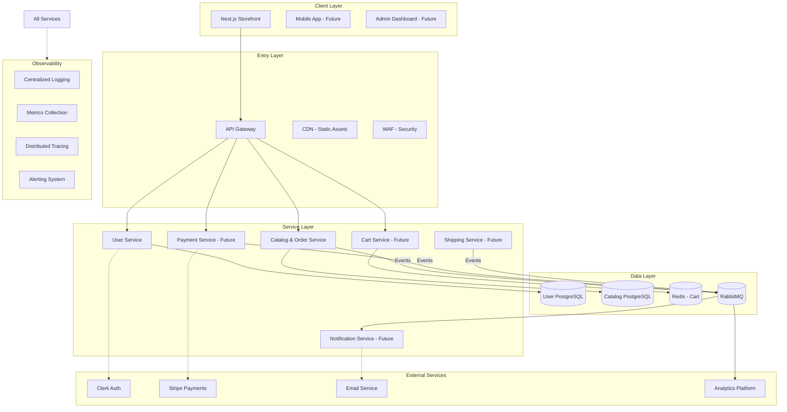
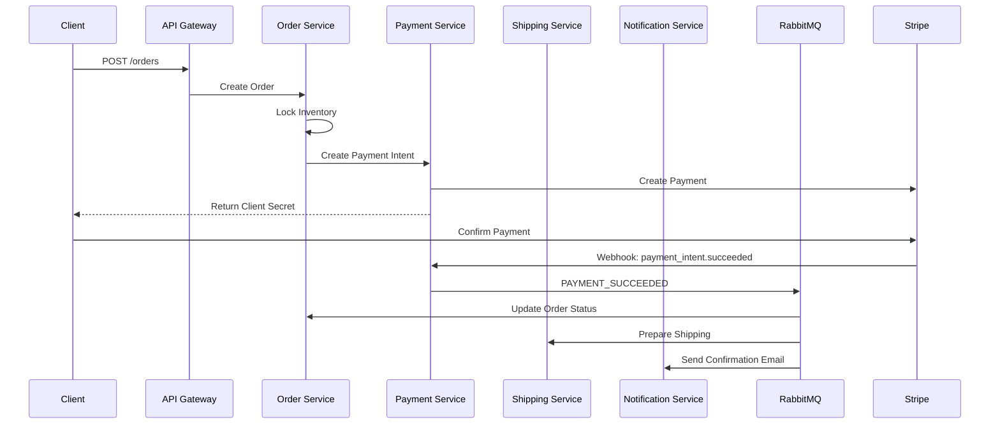
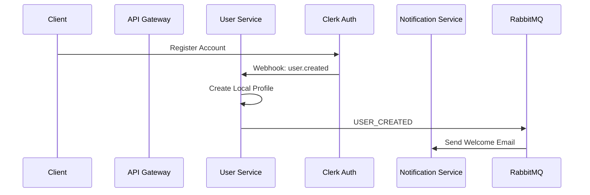

# Modular Mart - System Design

## Learning Project Architecture

### Architecture Overview

Modular Mart is a **personal learning project** that implements microservices architecture with clear separation of concerns, database-per-service pattern, and event-driven communication. The focus is on learning distributed systems concepts through practical implementation.



## Services/Modules

### 1. API Gateway

- **Technology**: NestJS
- **Responsibilities**:
  - Request routing and load balancing
  - JWT validation and authentication
  - Rate limiting and throttling
  - Request/response transformation
  - CORS and security headers
- **Endpoints**: `/api/*` prefix for all services
- **Deployment**: Stateless, horizontally scalable

### 2. User Service

- **Technology**: NestJS, TypeORM, PostgreSQL
- **Responsibilities**:
  - User profile management
  - Address book management
  - Role-based access control
  - Clerk authentication synchronization
- **Database**: Isolated PostgreSQL instance
- **Events**: `USER_CREATED`, `USER_UPDATED`, `ADDRESS_ADDED`

### 3. Catalog & Order Service

- **Technology**: NestJS, TypeORM, PostgreSQL
- **Responsibilities**:
  - Product catalog management
  - Inventory tracking and locking
  - Order creation and lifecycle management
  - Checkout saga orchestration
- **Database**: Isolated PostgreSQL instance
- **Events**: `ORDER_CREATED`, `ORDER_UPDATED`, `PAYMENT_REQUIRED`, `INVENTORY_UPDATED`

### 4. Cart Service (Future)

- **Technology**: NestJS, Redis
- **Responsibilities**:
  - Shopping cart management
  - Guest cart persistence
  - Cart merging on login
  - Inventory reservation
- **Storage**: Redis with TTL for guest carts
- **Events**: `CART_UPDATED`, `CART_ABANDONED`

### 5. Payment Service (Future)

- **Technology**: NestJS, Stripe SDK
- **Responsibilities**:
  - Payment intent creation
  - Webhook handling for Stripe events
  - Refund processing
  - Payment status synchronization
- **Integration**: Stripe API with webhook verification
- **Events**: `PAYMENT_SUCCEEDED`, `PAYMENT_FAILED`, `REFUND_PROCESSED`

### 6. Notification Service (Future)

- **Technology**: NestJS, RabbitMQ, Email SDK
- **Responsibilities**:
  - Email notification delivery
  - Real-time WebSocket notifications
  - Notification template management
  - Delivery tracking and retries
- **Channels**: Email, WebSocket, SMS (future)
- **Events**: Consumes various business events

### 7. Shipping Service (Future)

- **Technology**: NestJS, Carrier APIs
- **Responsibilities**:
  - Shipping rate calculation
  - Order fulfillment tracking
  - Carrier integration
  - Delivery status updates
- **Integration**: Mock carrier initially, real APIs later
- **Events**: `ORDER_SHIPPED`, `DELIVERY_UPDATED`

## Communication Flow

### Synchronous Communication (HTTP/REST)

```
Client → API Gateway → Service → Database
```

- Used for: User interactions, immediate responses
- Protocols: HTTP/1.1, HTTP/2
- Timeout: 30 seconds default
- Retry: 3 attempts with exponential backoff

### Asynchronous Communication (Events)

```
Service → RabbitMQ → Multiple Consumers
```

- Used for: Background processing, cross-service updates
- Protocol: AMQP 0-9-1
- Guarantees: At-least-once delivery
- Dead Letter: Failed messages to DLQ for inspection

### Data Flow Examples

#### Checkout Flow



#### User Registration Flow



## Data Flow

### Request Flow

1. **Client Request**: HTTPS request to API Gateway
2. **Authentication**: JWT validation via Clerk
3. **Routing**: Service discovery and load balancing
4. **Processing**: Business logic execution
5. **Persistence**: Database operations
6. **Events**: Async notifications if needed
7. **Response**: JSON response to client

### Event Flow

1. **Event Production**: Service publishes event to RabbitMQ exchange
2. **Routing**: Exchange routes to appropriate queues
3. **Consumption**: Services consume from their queues
4. **Processing**: Event handler executes business logic
5. **Acknowledgment**: Message acknowledged after processing
6. **Retry**: Failed messages go to retry queue

### Data Consistency

- **Strong Consistency**: Within service boundaries (ACID transactions)
- **Eventual Consistency**: Across services (event-driven updates)
- **Compensation**: Saga pattern for distributed transactions
- **Idempotency**: Event handlers are idempotent

## Deployment & Learning Environment

### Learning Infrastructure Stack

- **Frontend Hosting**: Vercel (serverless deployment for Next.js)
- **Backend Services**: Render (Docker container deployment)
- **Database**: NeonDB (serverless PostgreSQL for learning)
- **Cache**: Redis (optional, for learning caching patterns)
- **Message Queue**: RabbitMQ (local or cloud instance for learning events)
- **Authentication**: Clerk (external auth service integration)
- **Payments**: Stripe (payment processing learning)

### Development Environment

- **Local Development**: Docker Compose for all services
- **Code Organization**: Turborepo monorepo for shared packages
- **Database**: Local PostgreSQL with schema migrations
- **Testing**: Local test environment with seeded data

### Learning Deployment Strategy

- **Simple Deployment**: Focus on getting services deployed, not complex scaling
- **Cost Optimization**: Use free tiers and cost-effective services
- **Manual Deployment**: Learn deployment process before automation
- **Basic Monitoring**: Simple logging and health checks for learning

### Learning Security Practices

- **Environment Variables**: Proper secret management
- **API Security**: JWT validation, rate limiting basics
- **Database Security**: Connection pooling, basic access control
- **Payment Security**: Stripe best practices for PCI compliance

### Learning Observability

- **Structured Logging**: JSON logs for debugging
- **Health Checks**: Basic readiness/liveness probes
- **Error Tracking**: Centralized error logging
- **Performance Monitoring**: Basic response time tracking

## Learning Performance Goals

### Realistic Targets for Learning

- **API Response Time**: < 500ms for learning environment
- **Database Queries**: < 100ms for simple queries
- **Page Load Time**: < 3 seconds for development
- **Event Processing**: < 2 seconds for async operations

### Learning Scale Expectations

- **Concurrent Users**: 10-100 for testing concepts
- **Request Rate**: 10-100 requests/minute for learning
- **Data Volume**: Small datasets for development and testing
- **Availability**: Basic uptime, not production SLA

### Learning Success Criteria

- **Deployment Success**: All services deployable to cloud
- **Integration Working**: Services communicate correctly
- **Payment Flow**: Complete Stripe integration working
- **Code Quality**: Clean, maintainable code with tests
- **Documentation**: Clear setup and deployment instructions

---

_Last Updated: 2026-05-09_  
_Document Version: 1.0_
