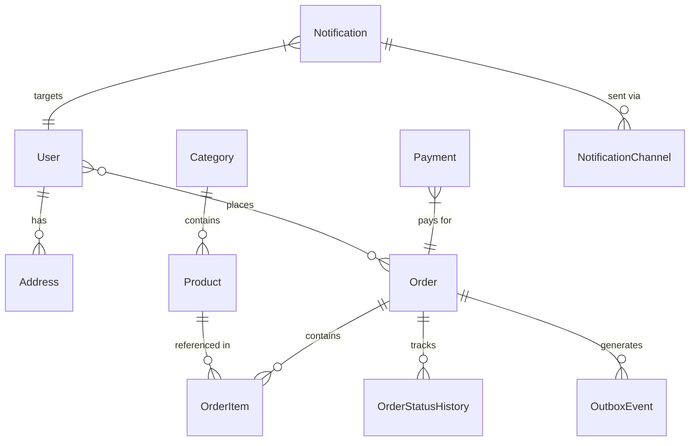

# Modular Mart - Data Model & Schema

## Service-Specific Schemas

### 1. User Service (User DB)
- **Users**: Core profiles synced from Clerk.
  - `clerk_id` (Unique), `email` (Unique), `first_name`, `last_name`.
- **Addresses**: Multi-address support for customers.
- **Roles**: RBAC management (CUSTOMER, SELLER, ADMIN).
- **UserRoles**: Join table for many-to-many role assignments.

### 2. Catalog Service (Catalog DB)
- **Products**: Sellable items with `seller_id`, `price`, and `stock_quantity`.
- **Categories**: Hierarchical product grouping.
- **ProcessedMessages**: Idempotency table for deduplicating incoming RabbitMQ events.

### 3. Order Service (Order DB)
- **Orders**: Lifecycle tracking with statuses (`PENDING_STOCK`, `PAID`, etc.).
- **OrderItems**: Snapshot of products, quantities, and prices at time of purchase.
- **OrderStatusHistory**: Audit trail for every status transition.
- **OutboxEvents**: Buffer for business events to be published asynchronously.
- **ProcessedMessages**: Idempotency table for deduplicating payment and stock events.

### 4. Payment Service (Payment DB)
- **Payments**: Transaction records linked to Stripe `payment_intent_id`.
- **Status**: PENDING, SUCCESS, FAILED, REFUNDED.

### 5. Notification Service (Notification DB)
- **Notifications**: Core message entities with read status.
- **NotificationChannels**: Delivery tracking per medium (Email, SSE).
- **NotificationTemplates**: Handlebars-based message blueprints.
- **NotificationPreferences**: User opt-in/out settings.
- **ProcessedMessages**: Idempotency for event-driven delivery.

## Relations Diagram



## Key Reliability Patterns

### Transactional Outbox (`outbox_events`)
Used in the **Order Service** to ensure atomicity between order state changes and event publishing.
```sql
CREATE TABLE outbox_events (
    id UUID PRIMARY KEY,
    event_type TEXT NOT NULL,
    payload JSONB NOT NULL,
    processed BOOLEAN DEFAULT FALSE,
    created_at TIMESTAMPTZ DEFAULT NOW()
);
```

### Idempotent Consumers (`processed_messages`)
Implemented in all services that consume RabbitMQ events to guarantee exactly-once processing.
```sql
CREATE TABLE processed_messages (
    id TEXT PRIMARY KEY, -- Usually the Message ID or Correlation ID
    event_type TEXT NOT NULL,
    processed_at TIMESTAMPTZ DEFAULT NOW()
);
```

### Order Status History
Provides a full audit trail for debugging and customer tracking.
```sql
CREATE TABLE order_status_history (
    id UUID PRIMARY KEY,
    order_id UUID REFERENCES orders(id),
    status TEXT NOT NULL,
    reason TEXT,
    created_at TIMESTAMPTZ DEFAULT NOW()
);
```

## Indexes

### User Service Indexes

```sql
-- Primary indexes (already defined by PRIMARY KEY)
-- Secondary indexes for performance
CREATE INDEX idx_users_clerk_id ON users(clerk_id);
CREATE INDEX idx_users_email ON users(email);
CREATE INDEX idx_addresses_user_id ON addresses(user_id);
CREATE INDEX idx_user_roles_user_id ON user_roles(user_id);
CREATE INDEX idx_user_roles_role_id ON user_roles(role_id);
```

### Catalog & Order Service Indexes

```sql
-- Primary indexes (already defined by PRIMARY KEY)
-- Secondary indexes for performance
CREATE INDEX idx_products_category_id ON products(category_id);
CREATE INDEX idx_products_slug ON products(slug);
CREATE INDEX idx_orders_user_id ON orders(user_id);
CREATE INDEX idx_orders_status ON orders(status);
CREATE INDEX idx_orders_created_at ON orders(created_at);
CREATE INDEX idx_order_items_order_id ON order_items(order_id);
CREATE INDEX idx_order_items_product_id ON order_items(product_id);
CREATE INDEX idx_payments_order_id ON payments(order_id);
CREATE INDEX idx_payments_status ON payments(status);
CREATE INDEX idx_payments_stripe_id ON payments(stripe_payment_intent_id);
```

## Constraints

### User Service Constraints

```sql
-- Unique constraints
ALTER TABLE users ADD CONSTRAINT uq_users_clerk_id UNIQUE (clerk_id);
ALTER TABLE users ADD CONSTRAINT uq_users_email UNIQUE (email);
ALTER TABLE roles ADD CONSTRAINT uq_roles_name UNIQUE (name);

-- Foreign key constraints
ALTER TABLE addresses ADD CONSTRAINT fk_addresses_user_id
    FOREIGN KEY (user_id) REFERENCES users(id) ON DELETE CASCADE;

ALTER TABLE user_roles ADD CONSTRAINT fk_user_roles_user_id
    FOREIGN KEY (user_id) REFERENCES users(id) ON DELETE CASCADE;

ALTER TABLE user_roles ADD CONSTRAINT fk_user_roles_role_id
    FOREIGN KEY (role_id) REFERENCES roles(id) ON DELETE CASCADE;

-- Check constraints
ALTER TABLE addresses ADD CONSTRAINT chk_address_country
    CHECK (country IN ('US', 'CA', 'UK', 'AU')); -- Example countries
```

### Catalog & Order Service Constraints

```sql
-- Unique constraints
ALTER TABLE categories ADD CONSTRAINT uq_categories_slug UNIQUE (slug);
ALTER TABLE products ADD CONSTRAINT uq_products_slug UNIQUE (slug);

-- Foreign key constraints
ALTER TABLE products ADD CONSTRAINT fk_products_category_id
    FOREIGN KEY (category_id) REFERENCES categories(id) ON DELETE SET NULL;

ALTER TABLE order_items ADD CONSTRAINT fk_order_items_order_id
    FOREIGN KEY (order_id) REFERENCES orders(id) ON DELETE CASCADE;

-- Check constraints
ALTER TABLE products ADD CONSTRAINT chk_products_price
    CHECK (price >= 0);

ALTER TABLE products ADD CONSTRAINT chk_products_stock
    CHECK (stock_quantity >= 0);

ALTER TABLE orders ADD CONSTRAINT chk_orders_total_amount
    CHECK (total_amount >= 0);

ALTER TABLE order_items ADD CONSTRAINT chk_order_items_quantity
    CHECK (quantity > 0);

ALTER TABLE order_items ADD CONSTRAINT chk_order_items_unit_price
    CHECK (unit_price >= 0);

ALTER TABLE payments ADD CONSTRAINT chk_payments_amount
    CHECK (amount >= 0);
```

## Schema Improvements Needed

### 1. Missing Audit Fields

**Current Issue**: Limited audit trail for critical operations
**Improvement**:

```sql
-- Add to all tables
ALTER TABLE users ADD COLUMN created_by UUID;
ALTER TABLE users ADD COLUMN updated_by UUID;
ALTER TABLE users ADD COLUMN deleted_at TIMESTAMPTZ;
ALTER TABLE users ADD COLUMN version INTEGER DEFAULT 1;
```

### 2. Product Variants Support

**Current Issue**: No support for product variants (size, color, etc.)
**Improvement**:

```sql
CREATE TABLE product_variants (
    id UUID PRIMARY KEY,
    product_id UUID NOT NULL REFERENCES products(id) ON DELETE CASCADE,
    sku TEXT NOT NULL UNIQUE,
    name TEXT NOT NULL,
    price_adjustment DECIMAL(10,2) DEFAULT 0,
    stock_quantity INT NOT NULL DEFAULT 0,
    attributes JSONB, -- { "size": "M", "color": "blue" }
    created_at TIMESTAMPTZ NOT NULL DEFAULT NOW(),
    updated_at TIMESTAMPTZ NOT NULL DEFAULT NOW()
);

CREATE INDEX idx_product_variants_product_id ON product_variants(product_id);
CREATE INDEX idx_product_variants_sku ON product_variants(sku);
```

### 3. Price History Tracking

**Current Issue**: No historical price tracking for analytics
**Improvement**:

```sql
CREATE TABLE price_history (
    id UUID PRIMARY KEY,
    product_id UUID NOT NULL, -- Logical reference
    price DECIMAL(10,2) NOT NULL,
    effective_from TIMESTAMPTZ NOT NULL DEFAULT NOW(),
    effective_to TIMESTAMPTZ,
    created_at TIMESTAMPTZ NOT NULL DEFAULT NOW()
);

CREATE INDEX idx_price_history_product_id ON price_history(product_id);
CREATE INDEX idx_price_history_effective_from ON price_history(effective_from);
```

### 4. Order Status Transition Logging

**Current Issue**: No audit trail for order status changes
**Improvement**:

```sql
CREATE TABLE order_status_transitions (
    id UUID PRIMARY KEY,
    order_id UUID NOT NULL, -- Logical reference
    from_status order_status,
    to_status order_status NOT NULL,
    changed_by UUID, -- User who made the change
    reason TEXT,
    created_at TIMESTAMPTZ NOT NULL DEFAULT NOW()
);

CREATE INDEX idx_order_status_transitions_order_id ON order_status_transitions(order_id);
CREATE INDEX idx_order_status_transitions_created_at ON order_status_transitions(created_at);
```

### 5. Customer Preferences

**Current Issue**: No storage for user preferences
**Improvement**:

```sql
CREATE TABLE user_preferences (
    id UUID PRIMARY KEY,
    user_id UUID NOT NULL REFERENCES users(id) ON DELETE CASCADE,
    preferences JSONB NOT NULL DEFAULT '{}',
    -- Example: { "email_notifications": true, "theme": "dark", "currency": "USD" }
    created_at TIMESTAMPTZ NOT NULL DEFAULT NOW(),
    updated_at TIMESTAMPTZ NOT NULL DEFAULT NOW()
);

CREATE INDEX idx_user_preferences_user_id ON user_preferences(user_id);
```

### 6. Seller Entities (Future)

**Current Issue**: No seller support in current schema
**Improvement**:

```sql
CREATE TABLE sellers (
    id UUID PRIMARY KEY,
    user_id UUID NOT NULL REFERENCES users(id) ON DELETE CASCADE,
    business_name TEXT NOT NULL,
    business_email TEXT NOT NULL UNIQUE,
    tax_id TEXT,
    status seller_status NOT NULL DEFAULT 'PENDING', -- PENDING, APPROVED, SUSPENDED
    commission_rate DECIMAL(5,2) DEFAULT 10.00, -- Platform commission percentage
    created_at TIMESTAMPTZ NOT NULL DEFAULT NOW(),
    updated_at TIMESTAMPTZ NOT NULL DEFAULT NOW()
);

CREATE TABLE seller_products (
    id UUID PRIMARY KEY,
    seller_id UUID NOT NULL REFERENCES sellers(id) ON DELETE CASCADE,
    product_id UUID NOT NULL, -- Logical reference to products
    seller_sku TEXT NOT NULL,
    seller_price DECIMAL(10,2) NOT NULL,
    seller_stock INT NOT NULL DEFAULT 0,
    is_active BOOLEAN DEFAULT TRUE,
    created_at TIMESTAMPTZ NOT NULL DEFAULT NOW(),
    updated_at TIMESTAMPTZ NOT NULL DEFAULT NOW(),
    UNIQUE(seller_id, product_id)
);
```

## Data Migration Strategy

### Phase 1: Schema Updates

1. Add audit fields to existing tables
2. Create new tables for variants and history
3. Backfill data where possible
4. Update application code to use new fields

### Phase 2: Data Migration

1. Migrate existing product data to variant structure
2. Create price history from current prices
3. Migrate order status changes to audit table
4. Validate data consistency

### Phase 3: Application Updates

1. Update APIs to support new schema
2. Update frontend to handle variants
3. Update reporting and analytics
4. Performance testing with new schema

## Performance Considerations

### 1. Index Optimization

- **Current**: Basic indexes on foreign keys
- **Improvement**: Composite indexes for common query patterns
- **Example**: `(user_id, status)` for order queries

### 2. Partitioning Strategy

- **Orders Table**: Partition by `created_at` (monthly)
- **Payments Table**: Partition by `created_at` (monthly)
- **Log Tables**: Partition by date for easy archival

### 3. Read Replicas

- **Analytics Queries**: Route to read replicas
- **Reporting**: Use dedicated reporting database
- **Caching**: Redis cache for frequently accessed data

### 4. Data Archival

- **Active Data**: Last 2 years in primary tables
- **Archival Data**: Older data moved to cold storage
- **Access Pattern**: Historical data via separate API

## Data Governance

### 1. Data Retention Policy

- **User Data**: Retain for 7 years after last activity
- **Order Data**: Retain indefinitely for tax purposes
- **Log Data**: Retain for 1 year
- **Backup Data**: Retain for 30 days

### 2. Data Privacy

- **PII Encryption**: Encrypt sensitive fields at rest
- **Data Masking**: Mask sensitive data in logs
- **Access Control**: Role-based data access
- **Audit Trail**: All data access logged

### 3. Data Quality

- **Validation Rules**: Enforce at database level
- **Consistency Checks**: Regular data integrity checks
- **Cleaning Jobs**: Scheduled data cleanup
- **Monitoring**: Alert on data quality issues

---

_Last Updated: 2026-05-09_  
_Document Version: 1.0_
